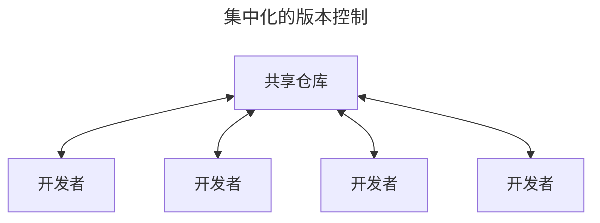

# 起步

通过本章的学习，你应该能了解为什么 Git 这么流行，为什么你应该使用 Git 以及你应该如何设置以便使用 Git。

## 1.1  关于版本控制

Version control is system that records changes to a file or set of files over time so that you can recall sepcific versions later.

**版本控制**（version control）：是一种记录一个或若干文件内容变化，以便将来查阅特定版本修订情况的系统。

### 1.1.1  集中化的版本控制系统

### 1.1.2  分布式版本控制系统

在该系统中，像 Git、Mercurial 以及 Darcs 等，客户端并不只提取最新版本的文件快照， 而是把代码仓库完整地镜像下来，包括完整的历史记录。 这么一来，任何一处协同工作用的服务器发生故障，事后都可以用任何一个镜像出来的本地仓库恢复。 因为每一次的克隆操作，实际上都是一次对代码仓库的完整备份。

## 1.2  Git简史

Git于 2005 年诞生以来，日臻成熟完善，在高度易用的同时，仍然保留着初期设定的目标。

* 速度
* 简单的设计
* 对非线性开发模式的强力支持
* 完全分布式
* 有能力高效管理类似 Linux 内核一样的超大规模项目

## 1.3  Git是什么？

### 直接记录快照，而非差异比较

Git更像是把数据看作是对小型文件系统的一系列快照。

在 Git 中，每当你提交更新或保存项目状态时，Git 基本上是对当时的全部文件创建一个快照包保存这个快照的索引。 为了提高效率，如果文件没有修改，Git 不再重新存储该文件，而是只保留一个链接指向之前存储的文件。

Git 对数据更像是一个**快照流**。

Git 更像是一个小型的文件系统，提供了许多以此为基础构建的超强工具，而不只是一个简单的 VCS。

### 几乎所有操作都是本地执行

在 Git 中绝大多数操作都只需要访问本地文件和资源，一般不需要来自网络上其他计算机的信息。因为你在**本地磁盘上就有项目的完整历史**，所以大部分操作看起来是瞬间完成的。

### Git保证完整性

**Git 中所有的数据在存储前都计算校验和，然后以校验和来引用。**这意味着不可能在 Git 不知情使时更改任何文件内容或补录内容。这个功能构建在 Git 的底层，是构成 Git 哲学不可或缺的部分。 若在传送过程中丢失信息或损坏文件，Git 就能发现。

**SHA-1 散列**是 Git 用于计算校验和的机制。这是由一个 40 个十六进制字符（0-9 和 a-f）组成的字符串，基于 Git 中文件的内容或目录结构计算出来。SHA-1 哈希看起来是这样：`24b9da6552252987aa493b52f8696cd6d3b00373`

实际上，Git 数据库中保存的信息都是以文件内容的哈希值来索引，而不是文件名。

**校验和**（checksum）：是一种用于验证数据完整性的方法。它通过对数据进行一系列的数学运算生成一个数值，这个数值被附加到数据末尾。当数据被传输或存储后，需要校验其完整性时，可以重新计算校验和，并于原始校验和进行比较。

* 如果两个校验和一致，说明数据没有在传输或存储过程中发生改变；
* 如果两个校验和不一致，则表明数据可能已损坏。

### Git通常只添加数据

对 Git 执行的操作，几乎只是往 Git 数据库中**添加**数据。也就是说，Git 几乎不会执行任何可能导致文件不可恢复的操作。

### 三种状态

请记住，<big> **你的文件只处于三种状态之一**</big>：

1. **已修改**（modified）
   * 表示修改了文件，但还没有保存到数据库中。
2. **已暂存**（staged）
   * 表示对一个已修改文件的当前版本做了标记，使之包含在瞎吃提交的快照中。
3. **已提交**（committed）
   * 表示数据已经安全的保存在本地数据库中。

三种状态使得 Git 项目拥有三个主要的部分：工作区、暂存区以及 Git 目录。

* **工作区**：是对项目某个版本独立提取出来内容。 这些从 Git 仓库的压缩数据库中提取出来的文件，放在磁盘上供你使用或修改。
* **暂存区**：是一个文件，保存了下次将要提交的文件列表信息，一般在 Git 仓库目录中。
* **Git 仓库目录**是 Git 用来保存项目的元数据和对象数据库的地方。 这是 Git 中最重要的部分，从其他计算机克隆仓库时，复制的就是这里的数据。

基本的 Git 工作流程如下：

1. 在工作区中修改文件。
2. 将想要下次提交的跟等选择性地暂存，这样只会将更改的部分添加到暂存区。
3. 提交更新，找到暂存区的文件，将快照永久性存储到 Git 目录。

* 如果 Git 目录中保存着特定版本的文件，就属于**已提交**状态。
* 如果文件已修改并放入暂存区，就属于**已暂存**状态。
* 如果自上次检出后，作了修改但还没有放到暂存区域，就是**已修改**状态。