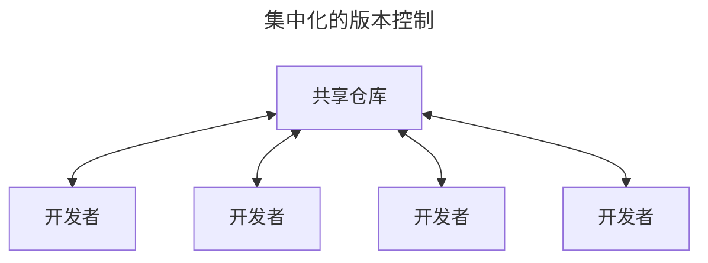

# 1  起步

通过本章的学习，你应该能了解为什么 Git 这么流行，为什么你应该使用 Git 以及你应该如何设置以便使用 Git。

## 1.1  关于版本控制

Version control is system that records changes to a file or set of files over time so that you can recall sepcific versions later.

**版本控制**（version control）：是一种记录一个或若干文件内容变化，以便将来查阅特定版本修订情况的系统。

### 1.1.1  集中化的版本控制系统



### 1.1.2  分布式版本控制系统

在该系统中，像 Git、Mercurial 以及 Darcs 等，客户端并不只提取最新版本的文件快照， 而是把代码仓库完整地镜像下来，包括完整的历史记录。 这么一来，任何一处协同工作用的服务器发生故障，事后都可以用任何一个镜像出来的本地仓库恢复。 因为每一次的克隆操作，实际上都是一次对代码仓库的完整备份。

## 1.2  Git简史

Git于 2005 年诞生以来，日臻成熟完善，在高度易用的同时，仍然保留着初期设定的目标。

* 速度
* 简单的设计
* 对非线性开发模式的强力支持
* 完全分布式
* 有能力高效管理类似 Linux 内核一样的超大规模项目

## 1.3  Git是什么？

### 直接记录快照，而非差异比较

Git更像是把数据看作是对小型文件系统的一系列快照。

在 Git 中，每当你提交更新或保存项目状态时，Git 基本上是对当时的全部文件创建一个快照包保存这个快照的索引。<br>为了提高效率，如果文件没有修改，Git 不再重新存储该文件，而是只保留一个链接指向之前存储的文件。

Git 对数据更像是一个**快照流**。

Git 更像是一个小型的文件系统，提供了许多以此为基础构建的超强工具，而不只是一个简单的 VCS。

### 几乎所有操作都是本地执行

在 Git 中绝大多数操作都只需要访问本地文件和资源，一般不需要来自网络上其他计算机的信息。因为你在**本地磁盘上就有项目的完整历史**，所以大部分操作看起来是瞬间完成的。

### Git保证完整性

**Git 中所有的数据在存储前都计算校验和，然后以校验和来引用。**这意味着不可能在 Git 不知情使时更改任何文件内容或补录内容。这个功能构建在 Git 的底层，是构成 Git 哲学不可或缺的部分。<br>若在传送过程中丢失信息或损坏文件，Git 就能发现。

**SHA-1 散列**是 Git 用于计算校验和的机制。这是由一个 40 个十六进制字符（0-9 和 a-f）组成的字符串，基于 Git 中文件的内容或目录结构计算出来。SHA-1 哈希看起来是这样：`24b9da6552252987aa493b52f8696cd6d3b00373`

实际上，Git 数据库中保存的信息都是以文件内容的哈希值来索引，而不是文件名。

**校验和**（checksum）：是一种用于验证数据完整性的方法。它通过对数据进行一系列的数学运算生成一个数值，这个数值被附加到数据末尾。当数据被传输或存储后，需要校验其完整性时，可以重新计算校验和，并于原始校验和进行比较。

* 如果两个校验和一致，说明数据没有在传输或存储过程中发生改变；
* 如果两个校验和不一致，则表明数据可能已损坏。

### Git通常只添加数据

对 Git 执行的操作，几乎只是往 Git 数据库中**添加**数据。也就是说，Git 几乎不会执行任何可能导致文件不可恢复的操作。

### 三种状态

请记住，<big> **你的文件只处于三种状态之一**</big>：

1. **已修改**（modified）
   * 表示修改了文件，但还没有保存到数据库中。
2. **已暂存**（staged）
   * 表示对一个已修改文件的当前版本做了标记，使之包含在瞎吃提交的快照中。
3. **已提交**（committed）
   * 表示数据已经安全的保存在本地数据库中。

三种状态使得 Git 项目拥有三个主要的部分：工作区、暂存区以及 Git 目录。


* **工作区**：是对项目某个版本独立提取出来内容。<br>这些从 Git 仓库的压缩数据库中提取出来的文件，放在磁盘上供你使用或修改。
* **暂存区**：是一个文件，保存了下次将要提交的文件列表信息，一般在 Git 仓库目录中。
* **Git 仓库目录**是 Git 用来保存项目的元数据和对象数据库的地方。<br>这是 Git 中最重要的部分，从其他计算机克隆仓库时，复制的就是这里的数据。

基本的 Git 工作流程如下：

1. 在工作区中修改文件。
2. 将想要下次提交的跟等选择性地暂存，这样只会将更改的部分添加到暂存区。
3. 提交更新，找到暂存区的文件，将快照永久性存储到 Git 目录。

* 如果 Git 目录中保存着特定版本的文件，就属于**已提交**状态。
* 如果文件已修改并放入暂存区，就属于**已暂存**状态。
* 如果自上次检出后，作了修改但还没有放到暂存区域，就是**已修改**状态。

## 1.4  命令行

只有在命令行模式下才能执行 Git 的**所有**命令，而大多数图形界面（GUIs）软件只实现了 Git 所有功能的一个子集以降低操作难度。

## 1.5  安装Git

在开始使用 Git 前，需要将它安装在你的计算机上。即便已经安装，最好将它升级到最新的版本。

### 在 macOS 上安装

在 Mac 上安装`Git`有多种方式。最简单的安装方法是安装`Xcode Command Line Tools`。Mavericks（10.9）或更高版本的系统中，在`Terminal`里尝试首次运行`git`命令即可。

```shell
$ git --version
```

在安装 Git 后，应确保 Git 是最新版本。使用 Homebrew更新升级的 Git 的方法是：

1. 首先确保 homebrew 自身是最新的：

   ```shell
   $ brew update
   ```

2. 然后升级 Git

   ```shell
   $ brew upgrade git
   ```

3. 检查 Git 版本

   ```shell
   $ git --version
   ```

## 1.6  初次运行Git前的配置

在系统上安装完毕 Git 后，对 Git 环境进行定制。<br>每台计算机只需配置一次，程序升级时会保留配置信息。<br>**可以随时通过运行命令来修改配置**。

Git 自带一个`git config`的工具来设置控制 Git 外观和行为的配置变量。这些变量存储在三个不同的位置：

1. `/etc/gitconfig`文件：包含计算机操作系统上每一个用户即他们仓库的通用配置。
   * 如果在执行`git config`时带上**`--system`**选项，那么它就会读写文件中的配置变量。
     * 由于它是系统配置文件，因此你需要管理员或超级用户权限来修改它。
2. `~/ .gitconfig`或`~/ .cofig/git/config`文件：只针对当前用户。
   * 可以传递**`--global`**选项让 Git 读写次文件，这会对你系统上**所有**的仓库生效。
3. 当前使用仓库的 Git 目录中的`config`（即`.git/config`）文件：针对该仓库。
   * 你可以传递**`--local`**选项让 Git 强制读写此文件，虽然默认情况下用的就是它。
     * 当然，你需要进入某个 Git 仓库中才能让该选项生效。

每一个级别会覆盖上一级别的配置，所以`.git/config`的配置变量会覆盖`/etc/gitconfig`中的配置变量。

可以通过以下命令查看所有的配置以及它们所在的文件：

```shell
$ git config --list --show-origin
```

### 用户信息

安装完 Git 后，要做的第一件事就是设置你的用户名和邮件地址。<br>这一点很重要，因为每一个 Git 提交都会使用到这些信息，它们会写入到你的每一次提交当中，不可更改。

```shell
$ git config --global user.name "Xiaolong Wang"
$ git config --global user.email shengdaomoluo@gmail.com
```

再次强调：

* 如果**使用了**`--global`选项，那么该命令只需要运行一次。因为之后无论你在该系统上做任何事情，Git 都会使用那些信息。
* 当你想针对特定项目使用不同的用户名称与邮件地址时，可以在那个项目目录下运行**没有**`--global`选项的命令来配置。

很多 GUI 工具都会在第一次运行时帮助用户配置这些信息。

### 文本编辑器

可以配置**默认文本编辑器**，当 Git 需要你输入信息时会调用它。<br>如果未配置，Git 会使用操作系统默认的文本编辑器。

如果想使用不同的文本编辑器，可以使用以下命令实现：

```shell
$ git config --global core.editor emacs #以文本编辑器 Emacs 为例。
```

### 默认分支名称

当使用`git init`命令创建一个新的Git目录（仓库）时，Git会创建一个名为`master`的默认分支。自Git2.28及以上版本，你可以为初始分支设置不同的名称。使用以下命令设置默认分支名称：

```shell
$ git config --global init.defaultBranch main #以分子名称“main”为例。
```

### 检查配置信息

如果想检查配置，可以使用`git config --list`命令来列出所有Git当时能找到的配置：

```shell
$ git config --list
```

在terminal环境下，配置查看完毕，按`control + z`退出查看。

可能会查看到重复的变量名，因为Git会从不同的文件中读取同一个配置（例如：`/etc/gitconfig`与`~/ .gitconfig`）。在这种情况下，Git会使用它找到的每一个变量的最后一个配置。

可以通过使用命令`git config <key>`，来检查Git的某一项配置：

```shell
$ git config user.name #检查设置的用户名
$ git config user.name #检查设置的用户邮件地址
$ git config core.editor #检查设置的默认文本编辑器
```

由于Git会从多个文件中读取同一配置变量的不同值，因此你可能会在其中看到意料之外的值而不知道为什么。此时，可以查询Git中该变量的**原始**值，它会告诉你哪一个配置文件最后设置了该值：

```shell
$ git config --show-origin rerere.autoupdate
```

### 1.7  获取帮助

若在使用Git时需要获取帮助，有三种等价的方法可以找到Git命令的综合手册（manpage）：

```shell
$ git help 
$ git --help
$ man git
```

如果不需要全面的手册，只需要可用选项的快速参考，可以用`-h`选项获得更简明的“help”输出：

```shell
$ git add -h
```

## 1.8  总结

* 知道了什么是Git；
* 了解了Git与集中式版本控制系统的区别。
* 在操作系统中建立了能够工作的Git版本。

# 2  Git基础

如果只需要阅读一章来学习Git，那么本章即是不二之选。本章涵盖了使用Git完成各种工作时会用到的各种基本命令。在本章学习完成后，可以做到：

1. 能够配置并初始化一个仓库（repository）、开始或停止跟踪（track）文件、暂存（stage）或提交（commit）更改。
2. 配置 Git 来忽略指定的文件或文件模式、迅速而简单地撤销错误操作、浏览项目的历史版本以及不同提交（commits）之间的差异、向远程仓库推送（push）或拉取（pull）文件。

## 2.1  获取仓库

通常有两种获取 Git 项目仓库的方式：

1. 将尚未进行版本控制的本地目录转换为 Git 仓库；
2. 从其它服务器**克隆**一个已存在的 Git 仓库。

两种方式都会在本地机器上得到一个工作就绪的 Git 仓库。

### 2.1.1 在已存在目录中初始化仓库

如果你有一个尚未进行版本控制的项目目录，想要用 Git 来控制它，那么首先需要进入到该项目目录当中去。

在 macOS 系统上，需要这样做：

```shell
$ cd /Users/user/my_project  # 进入到项目目录中
$ git init                   # 创建Git仓库
```

该命令将创建一个名为`.git`的子目录。这个子目录含有刚刚初始化的Git仓库中所有的必须文件，这些文件是Git仓库的骨干。但是，这个时候，仅仅是做了一个初始化的操作，项目里的文件并没有被跟踪。

如果在一个已存在文件的文件夹（而不是空文件夹）中进行版本控制，你应该开始追踪这些文件并进行初始提交。可以通过`git add`命令来指定所需的文件进行跟踪，然后执行`git commit`：

```shell
$ git add *.c
$ git add LICENSE
$ git commit -m 'initial project version'
```

现在，已经得到了一个存在被追踪文件与初始提交的Git仓库。

### 2.1.2  克隆现有仓库

如果想要获得一份已经存在了的Git仓库的拷贝，可使用`git clone`命令。

> Git克隆的是该git 仓库服务器上的几乎所有数据，而不是仅仅复制完成你的工作所需要文件。<br>当执行`git clone`命令的时候，默认配置下远程仓库中的每一个文件的每一个版本都将被拉取下来。
>
> 事实上，如果服务器的磁盘坏掉了，通常可以使用任何一个克隆下来的用户端来重建服务器上的仓库。

克隆仓库的命令是`git clone <url>`。比如，要克隆 Git 的链接库`libgit2`，可以用下面的命令：

```shell
$ git clone https://github.com/libgit2/libgit2
```

这会在**当前目录**中创建一个名为“libgit2”的目录，并在这个目录下（即“libgit2”） 初始化一个`.git`文件夹，从远程仓库拉取下所有数据放入`.git`文件夹，然后从中读取最新版本的文件的拷贝。<br>如果进入到新建的`libgit2`文件夹，你会发现所有的项目文件已经在里面了，准备就绪等待后续的开发和使用。

如果想在克隆仓库的时候，自定义本地仓库的名字，你可以通过额外的参数指定新的目录名：

```shell
$ git clone https://github.com/libgit2/libgit2 mylibgit
```

这会执行与上一条命令相同的操作，但目标目录名变为了`mylibgit`。

Git 支持多种数据传输协议。上面的例子使用的是`https://`协议，也可以使用`git://`协议或者 SSH 传输协议，比如，`user@server:path/to/repo.git`。

### 2.2  记录每次更新到Git仓库

**<big>务必记住：</big>**工作目录下的每一个文件都不外乎两种状态：**已跟踪**或**未跟踪**。

* **已跟踪**的文件是指：那些被纳入版本控制的文件，在上一次快照中有它们的记录。<br>在工作一段时间后，它们的状态可能是未修改、已修改或已修改且放入暂存区。<br>简言之，已跟踪的文件就是 Git 已经知道的文件。
  * 初次克隆的仓库里的所有文件都属于已跟踪文件，并处于未修改状态。
* **未跟踪**的文件：即除了已跟踪文件之外所有文件。<br>它们既不存在于上次快照的记录中，也没有放入暂存区。

编辑修改过的文件，是上次提交后做出的修改，Git 将它们标记为已修改文件。这些文件可以选择性地它们放入暂存区，然后提交已暂存的修改，如此反复。


### 2.2.1  创建一个新文件

可以使用下面的命令来创建一个新的文件：

```shell
$ echo 'My Project' > README.md  # ''内的“My Project”是新文件里要添加的内容
                                 # “README”是文件名；“.md”是文件格式 
```

当使用上面的命令后，你将会在当前目录下看到一个名为“README.md”的文件。打开该文件，里面显示的内容为“My Project”。

### 2.2.2  检查当前文件状态

**`git status`**是用来检查文件状态的命令，即检查哪些文件处于什么状态。

Git不会自动跟踪文件，除非明确地告诉Git“我需要跟踪该文件”。之所以这样处理，可以避免将生成的二进制文件或不想被跟踪的文件包含进来。因此，要想让Git跟踪想要跟踪的文件，需要使用相应的命令。

#### 2.2.2.1 状态简览

`git status`命令的输出十分详细，但其用语有些繁琐。Git由一个选项可以帮你缩短状态命令的输出，以简洁的方式查看更改。

**`git status -s`**或**`git status --short`**命令，可以将状态以更为紧凑的方式输出。输出的内容中：

* 左栏指明了暂存区的状态
  * `??`标记：表示新添加的未跟踪的文件。
  * `A`标记：新添加到暂存区中的文件。
  * `M`标记：修改过的文件。
* 右栏指明了工作区的状态

### 2.2.3 关于`git add`命令

**`git add`**命令可用于跟踪一个新文件文件。例如：

```shell
$ git add README.md  # "add"后必须输入完整的文件名，包括文件类型格式。
```

**`git add`**命令可用于暂存已修改的文件。即对已跟踪文件进行的修改，进行暂存。例如：

```shell
$ git add Git-Pro-Notes.md  # "add"后必须输入完整的文件名，包括文件类型格式。
```

`git add`命令具有多个功能：

* 可以用它来**跟踪新文件**；
* 可以把**已跟踪的文件放到暂存区**；
* 用于合并时把**有冲突的文件标记为已解决状态**。

这个命令的作用就是“**精确地将内容添加到下一次提交中**”，而不是“将一个文件添加到项目中”更为合适。<br><big>**注意：**</big>***运行了`git add`之后又作了修订的文件，需要重新运行`git add`命令把最新版本重新暂存起来***。

### 2.2.4 忽略文件

一般来说，总有一些文件无需纳入Git的管理，也不希望总是出现在未跟踪文件列表里。<br>无需纳入Git 管理的文件主要是：

* 自动生成的文件；
* 编译过程中创建的临时文件等。

在这种情况下，可以创建一个名为`.gitignore`的文件，列出要忽略的文件的模式。来看一个实际的`.gitignore`例子：

```shell
$ cat .gitignore
```

上述命令中的`cat`命令，是Unix/Linux系统中的一个在命令行中使用的命令，用于显示当前目录下的`.gitignore`文件的内容。这个命令由两个组件构成：

* **`cat`**命令：用于显示文件的内容。

  * 最基本的用法是直接跟随文件名，从而在终端中显示该文件的内容。例如：

    ```shell
    $ cat README.md
    ```

* **`.gitignore`**文件：是一个文本文件。
  * 用于告诉 Git 哪些文件或目录应该被忽略，不需要纳入版本控制中。

`.gitignore`文件的内容较为复杂，目前阶段只需要简单了解。稍后，进一步深入学习使用。

### 2.2.5  查看已暂存和未暂存的修改

**`git status`**是用来检查文件状态的命令，即检查哪些文件处于什么状态。当时如果想要查看文件修改的具体内容，该命令就无能为力了。

**`git diff`**命令，用于查看文件被修改的具体内容。该命令用来回答两个方面的问题：

1. 当前做的哪些更新尚未暂存？
2. 哪些更新已暂存并准备好下次提交？

虽然`git status`已经通过在相应栏下列出文件名的方式回答了这些问题，<br>但`git diff`能通过文件补丁的格式更加具体地显示哪些行发生了改变。

实际操作并仔细观察：<br>修改`README.md`文件后暂存；再编辑`Git-Pro-Notes.md`文件后先不暂存，运行`git status`命令，将能看到:


要查看尚未暂存的文件更新了哪些部分，不加参数直接输入`git diff`：


`git diff`命令比较的是**工作目录中当前文件**与**暂存区域快照**之间的差异。

`git diff --staged`命令是查看已暂存的将要添加到下次提交里的内容。<br>即比对**已暂存文件**与**最后一次提交的文件**差异。

以下图为例：


<big>**注意：**</big>`git diff`本身只显示尚未暂存的改动，而不是自上次提交以来所做的所有改动。

`git diff --cached`命令与`git diff --staged`是等价的，都是查看已经暂存起来的内容与工作目录之间的变化。

### 2.2.6  提交更新

在提交更新前，务必确认已修改或新建的文件已经使用过`git add `命令提交到暂存区中。<br>已修改但未暂存的文件只会保留在本地磁盘上。<br>所以，每次准备提交前，先用`git status`命令查看，所有需要提交的文件是否已经在暂存区中，再运行提交命令。

**`git commit`**是用来提交保存在已经在暂存区中文件。

* 在`git commit`命令后面添加`-m`选项，将本次提交的有关情况说明与命令放在同一行。例如：

```shell
$ git commit -m "将本次提交的有关情况说明与命令放在同一行。"
```

请记住，**提交时记录的是放在暂存区域里的快照**。<br>任何还未暂存的文件仍然保持已修改状态，可以在下次提交时纳入版本管理。

每一次运行**提交操作**，都是**对项目做了一次快照**，以后可回到这个状态，或者进行比较。

* 在`git commit` 命令后面添加`-a`选项，自动把所有已经跟踪跟踪过的文件暂存起来一并提交。<br>即跳过`git add`命令，不再使用暂存区域保存，再提交更新。执行以下命令：

  ```shell
  $ git commit -a -m 跳过`git add`命令，将未保存的内容直接提交更新。

注意：有时这个选项会将不需要的文件添加到提交中。

### 2.2.7  移除文件

要从 Git 中移除某个文件，就必须要从已跟踪文件清单中移除（确切地说，是从暂存区域移除），然后提交。

**`git rm`**命令可以移除已跟踪文件，并从工作目录中删除该文件。

`git rm`命令后添加`-f`（force 的首字母）选项，删除之前修改过的文件或已经放入暂存区的文件。<br>使用带有该选项的命令，用于防止误删尚未添加到快照的数据。

`git rm`命令后添加`--cached`选项，用于将文件保留在本地磁盘中，但不想让 Git 跟踪的文件。为了达到这一目的，使用`--cached`选项：

```shell
$ git rm --cached README.md  # `--cached`选项后，为要删除的完整文件名“README.md”。
```

### 2.2.8  移动文件（文件重命名）

**`git mv`**命令，可以将文件名进行重命名。该命令的格式如下：

```shell
$ git mv file_from file_to # “file_from”是原文件，“file_to”是要更改成的文件名，即现文件名。
# 示例如下：
$ git mv 旧文件名.md 现文件名.md  
```

## 2.3  查看提交历史

在提交了若干次更新，或者克隆了某个项目之后，需要对提交历史进行回顾，Git 提供了强大而丰富的命令工具来完成此项任务。

**`git log`**命令会按照时间先后顺序列出所有的提交。<br>命令会列出：

* 每个提交的SHA-1的校验和；
* 作者的名字和电子邮件地址；
* 提交时间以及提交说明。


`git log`命令由许多选项，有助于提高命令的执行效果。下面是最常用的选项：

* 选项`-p`或`--patch`，该选项会显示每次提交所引入的差异且按补丁（patch）格式输出。
  * 也可以在该选项（`-p`或`--patch`）后面使用整数（例如：`-2`）来显示最近几次的提交。

例如：显示最近两次提交的差异，所使用的完整命令如下：

```shell
$ git log -p -2
```


该选项除了显示基本信息之外，还附带了每次提交的变化。

* 选项`--stat`该选项会显示出每次提交的简略统计信息。

使用该选项的完整命令如下：

```shell
$ git log --stat
```

执行该命令的结果如下图：


* 选项`--pretty`该选项可以使用不同于默认格式的方式显示提交历史。这个选项有一些内建的子选项可供使用：

  * `oneline`会将每个提交放在一行显示。

  * `short`，`full`和`fuller`选项，它们展示信息的格式基本一致，但详尽程度不一。<br>以使用内建子选项`oneline`为例：

  * `format`选项，可以定制记录的显示格式。这样的输出对后期提取分析格式格外有用——输出的格式不会随着 Git 的更新而发生改变。以执行命令`git log --pretty=format:"%h - %an, %ar : %s"`为例，会显示如下的结果：

    * `git log --pretty=format`常用的选项列出了`format`接受的常用格式占位符的写法及其代表的意义。

      | 选项 | 说明                                      |      | 选项 | 说明                               |
      | :--- | ----------------------------------------- | ---- | ---- | ---------------------------------- |
      | %H   | 提交完整的哈希值                          |      | %h   | 提交的简写哈希值                   |
      | %T   | 树的完整哈希值                            |      | %t   | 树的简写哈希值                     |
      | %P   | 父提交的完整哈希值                        |      | %p   | 父提交的简写哈希值                 |
      | %an  | 作者名字                                  |      | %ae  | 作者的电子邮件地址                 |
      | %ad  | 作者修订日期（可以用`--date=选项`来定制） |      | %ar  | 作者修订日期，按多久以前的方式显示 |
      | %cn  | 提交者的名字                              |      | %ce  | 提交者的电子邮件                   |
      | %cd  | 提交日期                                  |      | %cr  | 提交日期（距今多长时间）           |
      | %s   | 提交说明                                  |      |      |                                    |

      表格中的**作者**与**提交者**是有区别的：<br>**作者**指的是对文件实际做出修改的人。<br>**提交者**指的是最后将此工作成果提交到仓库的人。<br>例如，当你为某个项目发布补丁，然后某个核心成员将你的补丁并入项目时，你就是作者，而那个核心成员就是提交者。

      * `--graph`选项可以与`oneline`或`format`结合使用，添加 ASCII 字符串来行李箱地展示分支、合并历史。以`git log --pretty=format:"%h %s" --graph`为例，将显示如下结果：

但`--pretty`选项只有在配合内建的子选项共同使用，才有效。

`git log`命令支持的专项如下表：

|      选项       | 说明                                         |      |       选项        | 说明                                                         |
| :-------------: | :------------------------------------------- | ---- | :---------------: | :----------------------------------------------------------- |
|      `-p`       | 按不定格式显示每个提交引入的差异。           |      | `--abbrev-commit` | 仅显示 SHA-1 校验和所有 40 个字符中的前几个字符。            |
|    `--stat`     | 显示每次提交的文件修改统计信息。             |      | `--relative-date` | 使用较短的相对时间而不是完整格式显示日期（比如“2weeks ago”）。 |
|  `--shortstat`  | 只显示`--stat`中最后的行数修改添加移除统计。 |      |     `--graph`     | 在日志旁以 ASCII 图形显示分支与合并历史。                    |
|  `--name-only`  | 仅在提交信息后显示已修改的文件清单。         |      |    `--pretty`     | 使用其他格式显示历史提交信息。可用的选项包括`oneline`、`short`、`full`、`fuller`和`format`（用来定义自己的格式）。 |
| `--name-status` | 显示新增、修改、删除的文件清单。             |      |     `oneline`     | `--pretty=oneline --abbrev-commit`合用的简写。               |

### 2.3.1  限制输出长度

`git log`命令有许多限制输出长度的选项，也就是**只输出一部分的提交**。

主要的`git log`限制输出的选项可见一下表格：

| 选项                  | 说明                                       |
| --------------------- | ------------------------------------------ |
| `-<n>`                | 仅显示最近的 n 条提交。                    |
| `--since`， `--after` | 仅显示指定时间之后的提交。                 |
| `--until`，`--before` | 仅显示指定时间之前的提交。                 |
| `--autor`             | 仅显示作者匹配指定字符串的提交。           |
| `--commiter`          | 仅显示提交者匹配指定字符串的提交。         |
| `--grep`              | 仅显示提交说明中包含指定字符串的提交。     |
| `-s`                  | 仅显示添加或删除内容匹配指定字符串的提交。 |

一个实际的例子：查看 XiaoLong Wang 在 2025 年 5 月 1日到 5 月 10 日期间的提交，可以使用下面的命令：

```shell
$ git log --pretty="%h -%s" --author='XiaoLong Wang' --since="2025-05-01" --before="2025-05-10"
```


## 2.4  撤消操作

在任何一个阶段都有可能需要进行撤消操作。下面将学习几个与撤消操作相关的命令：

1. 带有`--amend`选项的`git commit`命令，用于添加遗漏的文件或提交信息错误或为添加提交信息。<br>命令如下：

```shell
$ git commit --amend
```

使用该命令后，文本编辑器启动。关于文本编辑器，5 月 13 日写了一篇简明的使用教程，可以参阅。

最终只会有一个提交——第二次提交将会替代第一次提交的结果。

### 2.4.1  取消暂存的文件

```shell
$ git reset HEAD <file> # <file>为完整的文件名，包括文件名的后缀
```

该命令可以用来取消已经提交到暂存区的文件。

`git reset`是个“危险“”的命令，特别是加上了`--hard`选项则更是如此。

### 2.4.2  撤消对文件的修改

```shell
$ git checkout -- <file> # "--"与“<file>”之间有一个空格
```

该命令用于撤消尚未在暂存区的文件所做的修改。

**记住**，在Git中任何**已提交**的东西总是可以恢复的。甚至那些已经被删除的分支中的提交或使用`--amend`选项覆盖的提交也是可以恢复的。<br>但是，任何**未提交**的东西丢失后，很可能再也找不到了。

## 2.5  远程仓库的使用

**远程仓库**：是指托管在因特网或其他网络中的你的项目的版本库。<br>“远程”未必表示这个仓库在互联网或者网络上的其它位置，只是表示这个**版本库并不在你的工作目录中**。

管理远程仓库包括：

* 了解如何添加远程仓库；
* 移除无效的远程仓库；
* 管理不同的远程分支并定义他们是否被跟踪等等。

### 2.5.1  查看远程仓库

**`git remote`**命令是查看已经配置的远程仓库服务器。该命令：

* 会列出指定的每一个远程服务器的简写。
* 对已经克隆的自己的仓库，至少应该能看到`origin`——这是Git给你克隆的仓库服务器的默认名字。
* 指定`-v`选项，显示需要读写远程仓库使用的Git保存的简写与其对应的URL。

### 2.5.2  添加远程仓库

**`git remote add <shortname> <url>`**命令是添加一个新的远程Git仓库，并指定一个方便使用的简写。

以用该命令在 github的`Git-Pro-Notes`远程仓库中，添加一个名为 `GPNs`的新的远程仓库为例：

```shell
$ git remote add GPNs https://github.com/shengdaomoluo/Git-Pro-Notes.git
```

执行该命令后，通过 `git remote -v`查看远程仓库如下：

### 2.5.3  从远程仓库中抓取与拉取

**`git fetch <remote>`**命令可以从远程仓库中获取数据。这个命令会访问远程仓库，从中拉取所有你还没有的数据。执行完毕后，你将会拥有那个远程仓库中所有分支的引用，可以随时合并或查看。

**必须注意**：`git fetch`命令只会将数据下载到你的本地仓库——它不会自动合并或修改你当前的工作。当你准备好时，必须手动将其合并入你的工作。

### 2.5.4  推送到远程仓库

**`git push <remote> <branch>`**命令将项目推送到上游的远程仓库中。

比如要将`main`分支推送到`origin`服务器时，运行以下命令：

```shell
$ git push origin main
```

### 2.5.5  查看某个远程仓库

**`git remote show <remote>`**命令可以查看某一个远程仓库的更多信息。

比如想要查看 缩写名为`origin`的远程仓库的信息，可以执行以下命令：

```shell
$ git remote show origin
```

会得到下面的信息：<br>

### 2.5.6  远程仓库的重命名与移除

**`git remote rename`**命令用于修改一个远程仓库的简写名。

例如将远程仓库`origin`重命名为`GPNs`。可以执行以下命令：

```shell
$ git remote rename origin GPNs # “origin”为原简写名；“GPNs”为要更改的简写名
```

**`git remote remove`**或**`git remote rm`**命令可以移除一个远程仓库。

例如要移除简写名为`origin`远程仓库，可以使用以下命令：

```shell
$ git remote rm origin
```

会得到以下信息：<br>

## 2.6  打标签

**标签**（Tag）：是指Git仓库中提交的某个重要的功能或版本发布结点的标记。<br>Git提供两种标签模式：

1. 轻量标签（lightweight）：只是对特定提交的引用。
2. **附注标签**（annotated）：是存储在Git仓库中的一个完整的对象。<br>它可以被校验的，其中包含打标签者的名字、电子邮件地址、日期时间等。

### 2.6.1 列出标签

**`git tag`**命令用于以字母顺序列出已经存在的标签。

`git tag`默认列出完整的标签列表。此时，选项`-l`或`--list`是可选的。<br>如果使用一个匹配标签名的通配模式，那么`-l`或`--list`就是强制使用的。

### 2.6.2  创建标签

由于Git提供了两种标签模式，因此可以用两种方式创建不同的标签类型：

#### 创建附注标签

**`git tag -a -m "……"`**命令用于创建附注标签。

* `-a`选项在运行`tag`命令时，用于创建附注标签；
* `-m`选项用于指定一条将会存储在标签中的信息。<br>如果在创建附注标签时，不指定`-m`选项，那么 Git 会启动文本编辑器要求输入信息。

**`git show …`**命令用于查看标签信息及与之对应的提交信息。<br>`…`表示具体的表签名。例如：`v0.0.1`、`v1.4`等。

#### 创建轻量标签

**`git tag …`**命令用于创建一个轻量标签。不需要使用`-a`、`-m`或`-s`选项，只需要提供标签名。其中`…`表示标签名。

例如创建表签名为`v0.0.1-lw`的轻量标签，使用下面的命令：

```shell
$ git tag v0.0.1-lw
```

#### 后期打标签

可以对过去的提交打标签。也就是对某个已经提交了的项目标注标签。

**`git tag -a … *****`**命令可以为过去已经提交的项目标注附注标签。其中：

* `…`表示标签名；
* `*****`表示指定提交的校验和（或部分校验和）。

例如给已提交的项目`文本编辑器简明使用教程_以 vim 为例.md`打上名为`vim-tutorial_0.1`的附注标签，其已提交的校验和为`663a3e3215d12713eb6e311240ee4649378a86a0`可以使用以下命令：

```shell
$ git tag -a vim-tutorial_0.1 663a3332 -m "给已提交的项目《文本编辑器简明使用教程_以 vim 为例.md》打上名为《vim-tutorial_0.1》的附注标签"
```

执行`git tag`命令，显示名为 `vim-tutorial_0.1`在标签列表中：

执行`git show vim-tutorial_0.1`命令，显示该标签的具体情况：<br>

### 2.6.3 共享标签

默认情况下，`git push`命令会并不会传送标签到远程服务器上。在创建完标签后，必须**明确地**推送标签到共享服务器（例如 GitHub）上。

**`git push origin <tagname>`**命令可以将标签推送到共享服务器上。其中：<br>`origin`为服务器的简写名；`<tagname>`为要推送的标签名。

例如，将标签名为`vim-tutorial_0.1`的标签，推送到服务器简写名为`GPNs`的 GitHub 仓库中，可以使用以下命令：

```shell
$ git push GPNs vim-tutoriai_0.1
```

执行 `git push GPNs vim-tutorial_0.1`命令，显示如下：<br>

带有`--tags`选项的`git push`命令，可以将所有不在远程仓库服务器上的标签全部传送到那里。

例如,执行命令`git push GPNs --tags`可以将已创建的标签：`show`、`v0.0.1`、`v0.0.1-lw`和`v0.01`全部传送到远程仓库的服务器上（注：标签`vim-tutorial_0.1`已经使用命令`git push GPNs vim-tutorial_0.1`上传至远程仓库服务器）。显示如下：<br>

### 2.6.4  删除标签

**`git tag -d <tagname>`**命令，可以删除本地仓库上的标签。但是，该命令不会从任何远程仓库服务器中移除标签。

例如要删除名为`show`的标签，可以使用命令：

```shell
$ git tag -d show
```

执行`git tag -d show`显示如下：<br>

**`git push <remote> :refs/tags/<tagname>`**命令用来更新远程仓库服务器上的标签。该命令有两种变体：

1. **`git push <remote> :refs/tags/<tagname>`**，命令的含义是：将冒号前面的空值（null value）推送到远程表签名。

   例如：删除远程仓库服务器`GPNs`中名为`show`的标签，可执行以下命令：

   ```shell
   $ git push GPNs :refs/tags/show
   ```

   执行`git push GPNs :refs/tags/show`命令，显示如下：<br>

2. **`git push <remote> --delete <tagname>`**命令的含义是：删除远程仓库的某个标签。

   例如：删除远程仓库服务器`GPNs`中名为`v0.01`的标签，可以执行以下命令：

   ```shell
   $ git push GPNs --delete v0.01
   ```

   执行上述命令，显示如下：<br>

### 2.6.5 检出标签

**`git checkout <tagname>`**命令查看某个标签所指向的文件版本。

这个命令的执行有些复杂，所以，在尚未完全掌握 Git 的情况下，在执行该命令后，可以撤销该命令的执行。

**`git switch -`**命令用于撤消`git checkout <tagname>`命令。

## 2.7  Git别名

Git 不会在输入部分命令时，自动联想出想要输入的命令。可以通过设置**别名**的方式，在输入部分命令情况下，达到输入全部命令的目的。这样使得 Git 更简单、容易。

**`git config --global alias.xx ……`**命令，用于给完整的 Git 命令设置一个别名。在输入 Git 命令时，可使用别名命令来替代完整命令。例如：

```shell
$ git config --global alias.co checkout
$ git config --global alias.br branch
$ git config --global alias.ci commit
$ git config --global alias.st status
```

这意味着：

1. 当要输入`git checkout`时，只需要输入`git co`，即可执行`git checkout`（检出标签）命令。
2. 当要输入`git branch`时，只需要输入`git br`，即可执行`git branch`（查看分支）命令。
3. 当要输入`git commit`时，只需要输入`git ci`，即可执行`git commit`（提交暂存）命令。
4. 当要输入`git status`时，只需要输入`git st`，即可执行`git status`（查看状态）命令。

## 2.8  总结

本章学习完成了所有 Git 基本的**本地操作**。主要包括：

* 创建或克隆一个仓库；
* 对本地文件进行更改、暂存并提交这些更改；
* 浏览仓库从创建到目前的所有更改历史。

