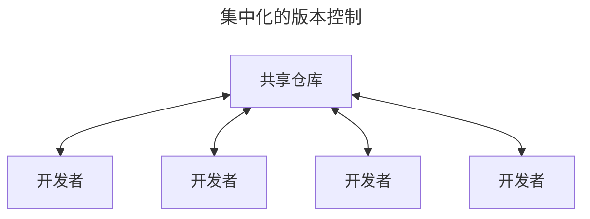

# 1  起步

通过本章的学习，你应该能了解为什么 Git 这么流行，为什么你应该使用 Git 以及你应该如何设置以便使用 Git。

## 1.1  关于版本控制

Version control is system that records changes to a file or set of files over time so that you can recall sepcific versions later.

**版本控制**（version control）：是一种记录一个或若干文件内容变化，以便将来查阅特定版本修订情况的系统。

### 1.1.1  集中化的版本控制系统



### 1.1.2  分布式版本控制系统

在该系统中，像 Git、Mercurial 以及 Darcs 等，客户端并不只提取最新版本的文件快照， 而是把代码仓库完整地镜像下来，包括完整的历史记录。 这么一来，任何一处协同工作用的服务器发生故障，事后都可以用任何一个镜像出来的本地仓库恢复。 因为每一次的克隆操作，实际上都是一次对代码仓库的完整备份。

## 1.2  Git简史

Git于 2005 年诞生以来，日臻成熟完善，在高度易用的同时，仍然保留着初期设定的目标。

* 速度
* 简单的设计
* 对非线性开发模式的强力支持
* 完全分布式
* 有能力高效管理类似 Linux 内核一样的超大规模项目

## 1.3  Git是什么？

### 直接记录快照，而非差异比较

Git更像是把数据看作是对小型文件系统的一系列快照。

在 Git 中，每当你提交更新或保存项目状态时，Git 基本上是对当时的全部文件创建一个快照包保存这个快照的索引。<br>为了提高效率，如果文件没有修改，Git 不再重新存储该文件，而是只保留一个链接指向之前存储的文件。

Git 对数据更像是一个**快照流**。

Git 更像是一个小型的文件系统，提供了许多以此为基础构建的超强工具，而不只是一个简单的 VCS。

### 几乎所有操作都是本地执行

在 Git 中绝大多数操作都只需要访问本地文件和资源，一般不需要来自网络上其他计算机的信息。因为你在**本地磁盘上就有项目的完整历史**，所以大部分操作看起来是瞬间完成的。

### Git保证完整性

**Git 中所有的数据在存储前都计算校验和，然后以校验和来引用。**这意味着不可能在 Git 不知情使时更改任何文件内容或补录内容。这个功能构建在 Git 的底层，是构成 Git 哲学不可或缺的部分。<br>若在传送过程中丢失信息或损坏文件，Git 就能发现。

**SHA-1 散列**是 Git 用于计算校验和的机制。这是由一个 40 个十六进制字符（0-9 和 a-f）组成的字符串，基于 Git 中文件的内容或目录结构计算出来。SHA-1 哈希看起来是这样：`24b9da6552252987aa493b52f8696cd6d3b00373`

实际上，Git 数据库中保存的信息都是以文件内容的哈希值来索引，而不是文件名。

**校验和**（checksum）：是一种用于验证数据完整性的方法。它通过对数据进行一系列的数学运算生成一个数值，这个数值被附加到数据末尾。当数据被传输或存储后，需要校验其完整性时，可以重新计算校验和，并于原始校验和进行比较。

* 如果两个校验和一致，说明数据没有在传输或存储过程中发生改变；
* 如果两个校验和不一致，则表明数据可能已损坏。

### Git通常只添加数据

对 Git 执行的操作，几乎只是往 Git 数据库中**添加**数据。也就是说，Git 几乎不会执行任何可能导致文件不可恢复的操作。

### 三种状态

请记住，<big> **你的文件只处于三种状态之一**</big>：

1. **已修改**（modified）
   * 表示修改了文件，但还没有保存到数据库中。
2. **已暂存**（staged）
   * 表示对一个已修改文件的当前版本做了标记，使之包含在瞎吃提交的快照中。
3. **已提交**（committed）
   * 表示数据已经安全的保存在本地数据库中。

三种状态使得 Git 项目拥有三个主要的部分：工作区、暂存区以及 Git 目录。


* **工作区**：是对项目某个版本独立提取出来内容。<br>这些从 Git 仓库的压缩数据库中提取出来的文件，放在磁盘上供你使用或修改。
* **暂存区**：是一个文件，保存了下次将要提交的文件列表信息，一般在 Git 仓库目录中。
* **Git 仓库目录**是 Git 用来保存项目的元数据和对象数据库的地方。<br>这是 Git 中最重要的部分，从其他计算机克隆仓库时，复制的就是这里的数据。

基本的 Git 工作流程如下：

1. 在工作区中修改文件。
2. 将想要下次提交的跟等选择性地暂存，这样只会将更改的部分添加到暂存区。
3. 提交更新，找到暂存区的文件，将快照永久性存储到 Git 目录。

* 如果 Git 目录中保存着特定版本的文件，就属于**已提交**状态。
* 如果文件已修改并放入暂存区，就属于**已暂存**状态。
* 如果自上次检出后，作了修改但还没有放到暂存区域，就是**已修改**状态。

## 1.4  命令行

只有在命令行模式下才能执行 Git 的**所有**命令，而大多数图形界面（GUIs）软件只实现了 Git 所有功能的一个子集以降低操作难度。

## 1.5  安装Git

在开始使用 Git 前，需要将它安装在你的计算机上。即便已经安装，最好将它升级到最新的版本。

### 在 macOS 上安装

在 Mac 上安装`Git`有多种方式。最简单的安装方法是安装`Xcode Command Line Tools`。Mavericks（10.9）或更高版本的系统中，在`Terminal`里尝试首次运行`git`命令即可。

```shell
$ git --version
```

在安装 Git 后，应确保 Git 是最新版本。使用 Homebrew更新升级的 Git 的方法是：

1. 首先确保 homebrew 自身是最新的：

   ```shell
   $ brew update
   ```

2. 然后升级 Git

   ```shell
   $ brew upgrade git
   ```

3. 检查 Git 版本

   ```shell
   $ git --version
   ```

## 1.6  初次运行Git前的配置

在系统上安装完毕 Git 后，对 Git 环境进行定制。<br>每台计算机只需配置一次，程序升级时会保留配置信息。<br>**可以随时通过运行命令来修改配置**。

Git 自带一个`git config`的工具来设置控制 Git 外观和行为的配置变量。这些变量存储在三个不同的位置：

1. `/etc/gitconfig`文件：包含计算机操作系统上每一个用户即他们仓库的通用配置。
   * 如果在执行`git config`时带上**`--system`**选项，那么它就会读写文件中的配置变量。
     * 由于它是系统配置文件，因此你需要管理员或超级用户权限来修改它。
2. `~/ .gitconfig`或`~/ .cofig/git/config`文件：只针对当前用户。
   * 可以传递**`--global`**选项让 Git 读写次文件，这会对你系统上**所有**的仓库生效。
3. 当前使用仓库的 Git 目录中的`config`（即`.git/config`）文件：针对该仓库。
   * 你可以传递**`--local`**选项让 Git 强制读写此文件，虽然默认情况下用的就是它。
     * 当然，你需要进入某个 Git 仓库中才能让该选项生效。

每一个级别会覆盖上一级别的配置，所以`.git/config`的配置变量会覆盖`/etc/gitconfig`中的配置变量。

可以通过以下命令查看所有的配置以及它们所在的文件：

```shell
$ git config --list --show-origin
```

### 用户信息

安装完 Git 后，要做的第一件事就是设置你的用户名和邮件地址。<br>这一点很重要，因为每一个 Git 提交都会使用到这些信息，它们会写入到你的每一次提交当中，不可更改。

```shell
$ git config --global user.name "Xiaolong Wang"
$ git config --global user.email shengdaomoluo@gmail.com
```

再次强调：

* 如果**使用了**`--global`选项，那么该命令只需要运行一次。因为之后无论你在该系统上做任何事情，Git 都会使用那些信息。
* 当你想针对特定项目使用不同的用户名称与邮件地址时，可以在那个项目目录下运行**没有**`--global`选项的命令来配置。

很多 GUI 工具都会在第一次运行时帮助用户配置这些信息。

### 文本编辑器

可以配置**默认文本编辑器**，当 Git 需要你输入信息时会调用它。<br>如果未配置，Git 会使用操作系统默认的文本编辑器。

如果想使用不同的文本编辑器，可以使用以下命令实现：

```shell
$ git config --global core.editor emacs #以文本编辑器 Emacs 为例。
```

### 默认分支名称

当使用`git init`命令创建一个新的Git目录（仓库）时，Git会创建一个名为`master`的默认分支。自Git2.28及以上版本，你可以为初始分支设置不同的名称。使用以下命令设置默认分支名称：

```shell
$ git config --global init.defaultBranch main #以分子名称“main”为例。
```

### 检查配置信息

如果想检查配置，可以使用`git config --list`命令来列出所有Git当时能找到的配置：

```shell
$ git config --list
```

在terminal环境下，配置查看完毕，按`control + z`退出查看。

可能会查看到重复的变量名，因为Git会从不同的文件中读取同一个配置（例如：`/etc/gitconfig`与`~/ .gitconfig`）。在这种情况下，Git会使用它找到的每一个变量的最后一个配置。

可以通过使用命令`git config <key>`，来检查Git的某一项配置：

```shell
$ git config user.name #检查设置的用户名
$ git config user.name #检查设置的用户邮件地址
$ git config core.editor #检查设置的默认文本编辑器
```

由于Git会从多个文件中读取同一配置变量的不同值，因此你可能会在其中看到意料之外的值而不知道为什么。此时，可以查询Git中该变量的**原始**值，它会告诉你哪一个配置文件最后设置了该值：

```shell
$ git config --show-origin rerere.autoupdate
```

### 1.7  获取帮助

若在使用Git时需要获取帮助，有三种等价的方法可以找到Git命令的综合手册（manpage）：

```shell
$ git help 
$ git --help
$ man git
```

如果不需要全面的手册，只需要可用选项的快速参考，可以用`-h`选项获得更简明的“help”输出：

```shell
$ git add -h
```

## 1.8  总结

* 知道了什么是Git；
* 了解了Git与集中式版本控制系统的区别。
* 在操作系统中建立了能够工作的Git版本。

# 2  Git基础

如果只需要阅读一章来学习Git，那么本章即是不二之选。本章涵盖了使用Git完成各种工作时会用到的各种基本命令。在本章学习完成后，可以做到：

1. 能够配置并初始化一个仓库（repository）、开始或停止跟踪（track）文件、暂存（stage）或提交（commit）更改。
2. 配置 Git 来忽略指定的文件或文件模式、迅速而简单地撤销错误操作、浏览项目的历史版本以及不同提交（commits）之间的差异、向远程仓库推送（push）或拉取（pull）文件。

## 2.1  获取仓库

通常有两种获取 Git 项目仓库的方式：

1. 将尚未进行版本控制的本地目录转换为 Git 仓库；
2. 从其它服务器**克隆**一个已存在的 Git 仓库。

两种方式都会在本地机器上得到一个工作就绪的 Git 仓库。

### 2.1.1 在已存在目录中初始化仓库

如果你有一个尚未进行版本控制的项目目录，想要用 Git 来控制它，那么首先需要进入到该项目目录当中去。

在 macOS 系统上，需要这样做：

```shell
$ cd /Users/user/my_project  # 进入到项目目录中
$ git init                   # 创建Git仓库
```

该命令将创建一个名为`.git`的子目录。这个子目录含有刚刚初始化的Git仓库中所有的必须文件，这些文件是Git仓库的骨干。但是，这个时候，仅仅是做了一个初始化的操作，项目里的文件并没有被跟踪。

如果在一个已存在文件的文件夹（而不是空文件夹）中进行版本控制，你应该开始追踪这些文件并进行初始提交。可以通过`git add`命令来指定所需的文件进行跟踪，然后执行`git commit`：

```shell
$ git add *.c
$ git add LICENSE
$ git commit -m 'initial project version'
```

现在，已经得到了一个存在被追踪文件与初始提交的Git仓库。

### 2.1.2  克隆现有仓库

如果想要获得一份已经存在了的Git仓库的拷贝，可使用`git clone`命令。

> Git克隆的是该git 仓库服务器上的几乎所有数据，而不是仅仅复制完成你的工作所需要文件。<br>当执行`git clone`命令的时候，默认配置下远程仓库中的每一个文件的每一个版本都将被拉取下来。
>
> 事实上，如果服务器的磁盘坏掉了，通常可以使用任何一个克隆下来的用户端来重建服务器上的仓库。

克隆仓库的命令是`git clone <url>`。比如，要克隆 Git 的链接库`libgit2`，可以用下面的命令：

```shell
$ git clone https://github.com/libgit2/libgit2
```

这会在**当前目录**中创建一个名为“libgit2”的目录，并在这个目录下（即“libgit2”） 初始化一个`.git`文件夹，从远程仓库拉取下所有数据放入`.git`文件夹，然后从中读取最新版本的文件的拷贝。<br>如果进入到新建的`libgit2`文件夹，你会发现所有的项目文件已经在里面了，准备就绪等待后续的开发和使用。

如果想在克隆仓库的时候，自定义本地仓库的名字，你可以通过额外的参数指定新的目录名：

```shell
$ git clone https://github.com/libgit2/libgit2 mylibgit
```

这会执行与上一条命令相同的操作，但目标目录名变为了`mylibgit`。

Git 支持多种数据传输协议。上面的例子使用的是`https://`协议，也可以使用`git://`协议或者 SSH 传输协议，比如，`user@server:path/to/repo.git`。


