# 1  起步

通过本章的学习，你应该能了解为什么 Git 这么流行，为什么你应该使用 Git 以及你应该如何设置以便使用 Git。

## 1.1  关于版本控制

Version control is system that records changes to a file or set of files over time so that you can recall sepcific versions later.

**版本控制**（version control）：是一种记录一个或若干文件内容变化，以便将来查阅特定版本修订情况的系统。

### 1.1.1  集中化的版本控制系统

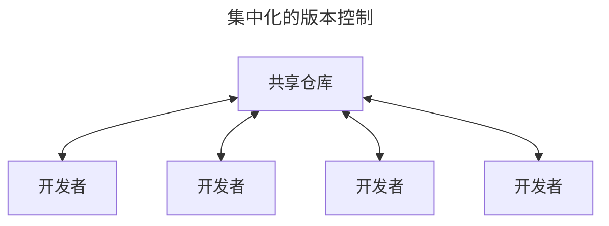

### 1.1.2  分布式版本控制系统

在该系统中，像 Git、Mercurial 以及 Darcs 等，客户端并不只提取最新版本的文件快照， 而是把代码仓库完整地镜像下来，包括完整的历史记录。 这么一来，任何一处协同工作用的服务器发生故障，事后都可以用任何一个镜像出来的本地仓库恢复。 因为每一次的克隆操作，实际上都是一次对代码仓库的完整备份。

## 1.2  Git简史

Git于 2005 年诞生以来，日臻成熟完善，在高度易用的同时，仍然保留着初期设定的目标。

* 速度
* 简单的设计
* 对非线性开发模式的强力支持
* 完全分布式
* 有能力高效管理类似 Linux 内核一样的超大规模项目

## 1.3  Git是什么？

### 直接记录快照，而非差异比较

Git更像是把数据看作是对小型文件系统的一系列快照。

在 Git 中，每当你提交更新或保存项目状态时，Git 基本上是对当时的全部文件创建一个快照包保存这个快照的索引。<br>为了提高效率，如果文件没有修改，Git 不再重新存储该文件，而是只保留一个链接指向之前存储的文件。

Git 对数据更像是一个**快照流**。

Git 更像是一个小型的文件系统，提供了许多以此为基础构建的超强工具，而不只是一个简单的 VCS。

### 几乎所有操作都是本地执行

在 Git 中绝大多数操作都只需要访问本地文件和资源，一般不需要来自网络上其他计算机的信息。因为你在**本地磁盘上就有项目的完整历史**，所以大部分操作看起来是瞬间完成的。

### Git保证完整性

**Git 中所有的数据在存储前都计算校验和，然后以校验和来引用。**这意味着不可能在 Git 不知情使时更改任何文件内容或补录内容。这个功能构建在 Git 的底层，是构成 Git 哲学不可或缺的部分。<br>若在传送过程中丢失信息或损坏文件，Git 就能发现。

**SHA-1 散列**是 Git 用于计算校验和的机制。这是由一个 40 个十六进制字符（0-9 和 a-f）组成的字符串，基于 Git 中文件的内容或目录结构计算出来。SHA-1 哈希看起来是这样：`24b9da6552252987aa493b52f8696cd6d3b00373`

实际上，Git 数据库中保存的信息都是以文件内容的哈希值来索引，而不是文件名。

**校验和**（checksum）：是一种用于验证数据完整性的方法。它通过对数据进行一系列的数学运算生成一个数值，这个数值被附加到数据末尾。当数据被传输或存储后，需要校验其完整性时，可以重新计算校验和，并于原始校验和进行比较。

* 如果两个校验和一致，说明数据没有在传输或存储过程中发生改变；
* 如果两个校验和不一致，则表明数据可能已损坏。

### Git通常只添加数据

对 Git 执行的操作，几乎只是往 Git 数据库中**添加**数据。也就是说，Git 几乎不会执行任何可能导致文件不可恢复的操作。

### 三种状态

请记住，<big> **你的文件只处于三种状态之一**</big>：

1. **已修改**（modified）
   * 表示修改了文件，但还没有保存到数据库中。
2. **已暂存**（staged）
   * 表示对一个已修改文件的当前版本做了标记，使之包含在瞎吃提交的快照中。
3. **已提交**（committed）
   * 表示数据已经安全的保存在本地数据库中。

三种状态使得 Git 项目拥有三个主要的部分：工作区、暂存区以及 Git 目录。


* **工作区**：是对项目某个版本独立提取出来内容。<br>这些从 Git 仓库的压缩数据库中提取出来的文件，放在磁盘上供你使用或修改。
* **暂存区**：是一个文件，保存了下次将要提交的文件列表信息，一般在 Git 仓库目录中。
* **Git 仓库目录**是 Git 用来保存项目的元数据和对象数据库的地方。<br>这是 Git 中最重要的部分，从其他计算机克隆仓库时，复制的就是这里的数据。

基本的 Git 工作流程如下：

1. 在工作区中修改文件。
2. 将想要下次提交的跟等选择性地暂存，这样只会将更改的部分添加到暂存区。
3. 提交更新，找到暂存区的文件，将快照永久性存储到 Git 目录。

* 如果 Git 目录中保存着特定版本的文件，就属于**已提交**状态。
* 如果文件已修改并放入暂存区，就属于**已暂存**状态。
* 如果自上次检出后，作了修改但还没有放到暂存区域，就是**已修改**状态。

## 1.4  命令行

只有在命令行模式下才能执行 Git 的**所有**命令，而大多数图形界面（GUIs）软件只实现了 Git 所有功能的一个子集以降低操作难度。

## 1.5  安装Git

在开始使用 Git 前，需要将它安装在你的计算机上。即便已经安装，最好将它升级到最新的版本。

### 在 macOS 上安装

在 Mac 上安装`Git`有多种方式。最简单的安装方法是安装`Xcode Command Line Tools`。Mavericks（10.9）或更高版本的系统中，在`Terminal`里尝试首次运行`git`命令即可。

```shell
$ git --version
```

在安装 Git 后，应确保 Git 是最新版本。使用 Homebrew更新升级的 Git 的方法是：

1. 首先确保 homebrew 自身是最新的：

   ```shell
   $ brew update
   ```

2. 然后升级 Git

   ```shell
   $ brew upgrade git
   ```

3. 检查 Git 版本

   ```shell
   $ git --version
   ```

## 1.6  初次运行Git前的配置

在系统上安装完毕 Git 后，对 Git 环境进行定制。<br>每台计算机只需配置一次，程序升级时会保留配置信息。<br>**可以随时通过运行命令来修改配置**。

Git 自带一个`git config`的工具来设置控制 Git 外观和行为的配置变量。这些变量存储在三个不同的位置：

1. `/etc/gitconfig`文件：包含计算机操作系统上每一个用户即他们仓库的通用配置。
   * 如果在执行`git config`时带上**`--system`**选项，那么它就会读写文件中的配置变量。
     * 由于它是系统配置文件，因此你需要管理员或超级用户权限来修改它。
2. `~/ .gitconfig`或`~/ .cofig/git/config`文件：只针对当前用户。
   * 可以传递**`--global`**选项让 Git 读写次文件，这会对你系统上**所有**的仓库生效。
3. 当前使用仓库的 Git 目录中的`config`（即`.git/config`）文件：针对该仓库。
   * 你可以传递**`--local`**选项让 Git 强制读写此文件，虽然默认情况下用的就是它。
     * 当然，你需要进入某个 Git 仓库中才能让该选项生效。

每一个级别会覆盖上一级别的配置，所以`.git/config`的配置变量会覆盖`/etc/gitconfig`中的配置变量。

可以通过以下命令查看所有的配置以及它们所在的文件：

```shell
$ git config --list --show-origin
```

### 用户信息

安装完 Git 后，要做的第一件事就是设置你的用户名和邮件地址。<br>这一点很重要，因为每一个 Git 提交都会使用到这些信息，它们会写入到你的每一次提交当中，不可更改。

```shell
$ git config --global user.name "Xiaolong Wang"
$ git config --global user.email shengdaomoluo@gmail.com
```

再次强调：

* 如果**使用了**`--global`选项，那么该命令只需要运行一次。因为之后无论你在该系统上做任何事情，Git 都会使用那些信息。
* 当你想针对特定项目使用不同的用户名称与邮件地址时，可以在那个项目目录下运行**没有**`--global`选项的命令来配置。

很多 GUI 工具都会在第一次运行时帮助用户配置这些信息。

### 文本编辑器

可以配置**默认文本编辑器**，当 Git 需要你输入信息时会调用它。<br>如果未配置，Git 会使用操作系统默认的文本编辑器。

如果想使用不同的文本编辑器，可以使用以下命令实现：

```shell
$ git config --global core.editor emacs #以文本编辑器 Emacs 为例。
```

### 默认分支名称

当使用`git init`命令创建一个新的Git目录（仓库）时，Git会创建一个名为`master`的默认分支。自Git2.28及以上版本，你可以为初始分支设置不同的名称。使用以下命令设置默认分支名称：

```shell
$ git config --global init.defaultBranch main #以分子名称“main”为例。
```

### 检查配置信息

如果想检查配置，可以使用`git config --list`命令来列出所有Git当时能找到的配置：

```shell
$ git config --list
```

在terminal环境下，配置查看完毕，按`control + z`退出查看。

可能会查看到重复的变量名，因为Git会从不同的文件中读取同一个配置（例如：`/etc/gitconfig`与`~/ .gitconfig`）。在这种情况下，Git会使用它找到的每一个变量的最后一个配置。

可以通过使用命令`git config <key>`，来检查Git的某一项配置：

```shell
$ git config user.name #检查设置的用户名
$ git config user.name #检查设置的用户邮件地址
$ git config core.editor #检查设置的默认文本编辑器
```

由于Git会从多个文件中读取同一配置变量的不同值，因此你可能会在其中看到意料之外的值而不知道为什么。此时，可以查询Git中该变量的**原始**值，它会告诉你哪一个配置文件最后设置了该值：

```shell
$ git config --show-origin rerere.autoupdate
```

### 1.7  获取帮助

若在使用Git时需要获取帮助，有三种等价的方法可以找到Git命令的综合手册（manpage）：

```shell
$ git help 
$ git --help
$ man git
```

如果不需要全面的手册，只需要可用选项的快速参考，可以用`-h`选项获得更简明的“help”输出：

```shell
$ git add -h
```

## 1.8  总结

* 知道了什么是Git；
* 了解了Git与集中式版本控制系统的区别。
* 在操作系统中建立了能够工作的Git版本。

# 2  Git基础

如果只需要阅读一章来学习Git，那么本章即是不二之选。本章涵盖了使用Git完成各种工作时会用到的各种基本命令。在本章学习完成后，可以做到：

1. 能够配置并初始化一个仓库（repository）、开始或停止跟踪（track）文件、暂存（stage）或提交（commit）更改。
2. 配置 Git 来忽略指定的文件或文件模式、迅速而简单地撤销错误操作、浏览项目的历史版本以及不同提交（commits）之间的差异、向远程仓库推送（push）或拉取（pull）文件。

## 2.1  获取仓库

通常有两种获取 Git 项目仓库的方式：

1. 将尚未进行版本控制的本地目录转换为 Git 仓库；
2. 从其它服务器**克隆**一个已存在的 Git 仓库。

两种方式都会在本地机器上得到一个工作就绪的 Git 仓库。

### 2.1.1 在已存在目录中初始化仓库

如果你有一个尚未进行版本控制的项目目录，想要用 Git 来控制它，那么首先需要进入到该项目目录当中去。

在 macOS 系统上，需要这样做：

```shell
$ cd /Users/user/my_project  # 进入到项目目录中
$ git init                   # 创建Git仓库
```

该命令将创建一个名为`.git`的子目录。这个子目录含有刚刚初始化的Git仓库中所有的必须文件，这些文件是Git仓库的骨干。但是，这个时候，仅仅是做了一个初始化的操作，项目里的文件并没有被跟踪。

如果在一个已存在文件的文件夹（而不是空文件夹）中进行版本控制，你应该开始追踪这些文件并进行初始提交。可以通过`git add`命令来指定所需的文件进行跟踪，然后执行`git commit`：

```shell
$ git add *.c
$ git add LICENSE
$ git commit -m 'initial project version'
```

现在，已经得到了一个存在被追踪文件与初始提交的Git仓库。

### 2.1.2  克隆现有仓库

如果想要获得一份已经存在了的Git仓库的拷贝，可使用`git clone`命令。

> Git克隆的是该git 仓库服务器上的几乎所有数据，而不是仅仅复制完成你的工作所需要文件。<br>当执行`git clone`命令的时候，默认配置下远程仓库中的每一个文件的每一个版本都将被拉取下来。
>
> 事实上，如果服务器的磁盘坏掉了，通常可以使用任何一个克隆下来的用户端来重建服务器上的仓库。

克隆仓库的命令是`git clone <url>`。比如，要克隆 Git 的链接库`libgit2`，可以用下面的命令：

```shell
$ git clone https://github.com/libgit2/libgit2
```

这会在**当前目录**中创建一个名为“libgit2”的目录，并在这个目录下（即“libgit2”） 初始化一个`.git`文件夹，从远程仓库拉取下所有数据放入`.git`文件夹，然后从中读取最新版本的文件的拷贝。<br>如果进入到新建的`libgit2`文件夹，你会发现所有的项目文件已经在里面了，准备就绪等待后续的开发和使用。

如果想在克隆仓库的时候，自定义本地仓库的名字，你可以通过额外的参数指定新的目录名：

```shell
$ git clone https://github.com/libgit2/libgit2 mylibgit
```

这会执行与上一条命令相同的操作，但目标目录名变为了`mylibgit`。

Git 支持多种数据传输协议。上面的例子使用的是`https://`协议，也可以使用`git://`协议或者 SSH 传输协议，比如，`user@server:path/to/repo.git`。

### 2.2  记录每次更新到Git仓库

**<big>务必记住：</big>**工作目录下的每一个文件都不外乎两种状态：**已跟踪**或**未跟踪**。

* **已跟踪**的文件是指：那些被纳入版本控制的文件，在上一次快照中有它们的记录。<br>在工作一段时间后，它们的状态可能是未修改、已修改或已修改且放入暂存区。<br>简言之，已跟踪的文件就是 Git 已经知道的文件。
  * 初次克隆的仓库里的所有文件都属于已跟踪文件，并处于未修改状态。
* **未跟踪**的文件：即除了已跟踪文件之外所有文件。<br>它们既不存在于上次快照的记录中，也没有放入暂存区。

编辑修改过的文件，是上次提交后做出的修改，Git 将它们标记为已修改文件。这些文件可以选择性地它们放入暂存区，然后提交已暂存的修改，如此反复。


### 2.2.1  创建一个新文件

可以使用下面的命令来创建一个新的文件：

```shell
$ echo 'My Project' > README.md  # ''内的“My Project”是新文件里要添加的内容
                                 # “README”是文件名；“.md”是文件格式 
```

当使用上面的命令后，你将会在当前目录下看到一个名为“README.md”的文件。打开该文件，里面显示的内容为“My Project”。

### 2.2.2  检查当前文件状态

**`git status`**是用来检查文件状态的命令，即检查哪些文件处于什么状态。

Git不会自动跟踪文件，除非明确地告诉Git“我需要跟踪该文件”。之所以这样处理，可以避免将生成的二进制文件或不想被跟踪的文件包含进来。因此，要想让Git跟踪想要跟踪的文件，需要使用相应的命令。

#### 2.2.2.1 状态简览

`git status`命令的输出十分详细，但其用语有些繁琐。Git由一个选项可以帮你缩短状态命令的输出，以简洁的方式查看更改。

**`git status -s`**或**`git status --short`**命令，可以将状态以更为紧凑的方式输出。输出的内容中：

* 左栏指明了暂存区的状态
  * `??`标记：表示新添加的未跟踪的文件。
  * `A`标记：新添加到暂存区中的文件。
  * `M`标记：修改过的文件。
* 右栏指明了工作区的状态

### 2.2.3 关于`git add`命令

**`git add`**命令可用于跟踪一个新文件文件。例如：

```shell
$ git add README.md  # "add"后必须输入完整的文件名，包括文件类型格式。
```

**`git add`**命令可用于暂存已修改的文件。即对已跟踪文件进行的修改，进行暂存。例如：

```shell
$ git add Git-Pro-Notes.md  # "add"后必须输入完整的文件名，包括文件类型格式。
```

`git add`命令具有多个功能：

* 可以用它来**跟踪新文件**；
* 可以把**已跟踪的文件放到暂存区**；
* 用于合并时把**有冲突的文件标记为已解决状态**。

这个命令的作用就是“**精确地将内容添加到下一次提交中**”，而不是“将一个文件添加到项目中”更为合适。<br><big>**注意：**</big>***运行了`git add`之后又作了修订的文件，需要重新运行`git add`命令把最新版本重新暂存起来***。

### 2.2.4 忽略文件

一般来说，总有一些文件无需纳入Git的管理，也不希望总是出现在未跟踪文件列表里。<br>无需纳入Git 管理的文件主要是：

* 自动生成的文件；
* 编译过程中创建的临时文件等。

在这种情况下，可以创建一个名为`.gitignore`的文件，列出要忽略的文件的模式。来看一个实际的`.gitignore`例子：

```shell
$ cat .gitignore
```

上述命令中的`cat`命令，是Unix/Linux系统中的一个在命令行中使用的命令，用于显示当前目录下的`.gitignore`文件的内容。这个命令由两个组件构成：

* **`cat`**命令：用于显示文件的内容。

  * 最基本的用法是直接跟随文件名，从而在终端中显示该文件的内容。例如：

    ```shell
    $ cat README.md
    ```

* **`.gitignore`**文件：是一个文本文件。
  * 用于告诉 Git 哪些文件或目录应该被忽略，不需要纳入版本控制中。

`.gitignore`文件的内容较为复杂，目前阶段只需要简单了解。稍后，进一步深入学习使用。

### 2.2.5  查看已暂存和未暂存的修改

**`git status`**是用来检查文件状态的命令，即检查哪些文件处于什么状态。当时如果想要查看文件修改的具体内容，该命令就无能为力了。

**`git diff`**命令，用于查看文件被修改的具体内容。该命令用来回答两个方面的问题：

1. 当前做的哪些更新尚未暂存？
2. 哪些更新已暂存并准备好下次提交？

虽然`git status`已经通过在相应栏下列出文件名的方式回答了这些问题，<br>但`git diff`能通过文件补丁的格式更加具体地显示哪些行发生了改变。

实际操作并仔细观察：<br>修改`README.md`文件后暂存；再编辑`Git-Pro-Notes.md`文件后先不暂存，运行`git status`命令，将能看到:


要查看尚未暂存的文件更新了哪些部分，不加参数直接输入`git diff`：


`git diff`命令比较的是**工作目录中当前文件**与**暂存区域快照**之间的差异。

`git diff --staged`命令是查看已暂存的将要添加到下次提交里的内容。<br>即比对**已暂存文件**与**最后一次提交的文件**差异。

以下图为例：


<big>**注意：**</big>`git diff`本身只显示尚未暂存的改动，而不是自上次提交以来所做的所有改动。

`git diff --cached`命令与`git diff --staged`是等价的，都是查看已经暂存起来的内容与工作目录之间的变化。

### 2.2.6  提交更新

在提交更新前，务必确认已修改或新建的文件已经使用过`git add `命令提交到暂存区中。<br>已修改但未暂存的文件只会保留在本地磁盘上。<br>所以，每次准备提交前，先用`git status`命令查看，所有需要提交的文件是否已经在暂存区中，再运行提交命令。

**`git commit`**是用来提交保存在已经在暂存区中文件。

* 在`git commit`命令后面添加`-m`选项，将本次提交的有关情况说明与命令放在同一行。例如：

```shell
$ git commit -m "将本次提交的有关情况说明与命令放在同一行。"
```

请记住，**提交时记录的是放在暂存区域里的快照**。<br>任何还未暂存的文件仍然保持已修改状态，可以在下次提交时纳入版本管理。

每一次运行**提交操作**，都是**对项目做了一次快照**，以后可回到这个状态，或者进行比较。

* 在`git commit` 命令后面添加`-a`选项，自动把所有已经跟踪跟踪过的文件暂存起来一并提交。<br>即跳过`git add`命令，不再使用暂存区域保存，再提交更新。执行以下命令：

  ```shell
  $ git commit -a -m 跳过`git add`命令，将未保存的内容直接提交更新。

注意：有时这个选项会将不需要的文件添加到提交中。

### 2.2.7  移除文件

要从 Git 中移除某个文件，就必须要从已跟踪文件清单中移除（确切地说，是从暂存区域移除），然后提交。

**`git rm`**命令可以移除已跟踪文件，并从工作目录中删除该文件。

`git rm`命令后添加`-f`（force 的首字母）选项，删除之前修改过的文件或已经放入暂存区的文件。<br>使用带有该选项的命令，用于防止误删尚未添加到快照的数据。

`git rm`命令后添加`--cached`选项，用于将文件保留在本地磁盘中，但不想让 Git 跟踪的文件。为了达到这一目的，使用`--cached`选项：

```shell
$ git rm --cached README.md  # `--cached`选项后，为要删除的完整文件名“README.md”。
```

### 2.2.8  移动文件（文件重命名）

**`git mv`**命令，可以将文件名进行重命名。该命令的格式如下：

```shell
$ git mv file_from file_to # “file_from”是原文件，“file_to”是要更改成的文件名，即现文件名。
# 示例如下：
$ git mv 旧文件名.md 现文件名.md  
```

## 2.3  查看提交历史

在提交了若干次更新，或者克隆了某个项目之后，需要对提交历史进行回顾，Git 提供了强大而丰富的命令工具来完成此项任务。

**`git log`**命令会按照时间先后顺序列出所有的提交。<br>命令会列出：

* 每个提交的SHA-1的校验和；
* 作者的名字和电子邮件地址；
* 提交时间以及提交说明。


`git log`命令由许多选项，有助于提高命令的执行效果。下面是最常用的选项：

* 选项`-p`或`--patch`，该选项会显示每次提交所引入的差异且按补丁（patch）格式输出。
  * 也可以在该选项（`-p`或`--patch`）后面使用整数（例如：`-2`）来显示最近几次的提交。

例如：显示最近两次提交的差异，所使用的完整命令如下：

```shell
$ git log -p -2
```


该选项除了显示基本信息之外，还附带了每次提交的变化。

* 选项`--stat`该选项会显示出每次提交的简略统计信息。

使用该选项的完整命令如下：

```shell
$ git log --stat
```

执行该命令的结果如下图：


* 选项`--pretty`该选项可以使用不同于默认格式的方式显示提交历史。这个选项有一些内建的子选项可供使用：

  * `oneline`会将每个提交放在一行显示。

  * `short`，`full`和`fuller`选项，它们展示信息的格式基本一致，但详尽程度不一。<br>以使用内建子选项`oneline`为例：

  * `format`选项，可以定制记录的显示格式。这样的输出对后期提取分析格式格外有用——输出的格式不会随着 Git 的更新而发生改变。以执行命令`git log --pretty=format:"%h - %an, %ar : %s"`为例，会显示如下的结果：

    * `git log --pretty=format`常用的选项列出了`format`接受的常用格式占位符的写法及其代表的意义。

      | 选项 | 说明                                      |      | 选项 | 说明                               |
      | :--- | ----------------------------------------- | ---- | ---- | ---------------------------------- |
      | %H   | 提交完整的哈希值                          |      | %h   | 提交的简写哈希值                   |
      | %T   | 树的完整哈希值                            |      | %t   | 树的简写哈希值                     |
      | %P   | 父提交的完整哈希值                        |      | %p   | 父提交的简写哈希值                 |
      | %an  | 作者名字                                  |      | %ae  | 作者的电子邮件地址                 |
      | %ad  | 作者修订日期（可以用`--date=选项`来定制） |      | %ar  | 作者修订日期，按多久以前的方式显示 |
      | %cn  | 提交者的名字                              |      | %ce  | 提交者的电子邮件                   |
      | %cd  | 提交日期                                  |      | %cr  | 提交日期（距今多长时间）           |
      | %s   | 提交说明                                  |      |      |                                    |

      表格中的**作者**与**提交者**是有区别的：<br>**作者**指的是对文件实际做出修改的人。<br>**提交者**指的是最后将此工作成果提交到仓库的人。<br>例如，当你为某个项目发布补丁，然后某个核心成员将你的补丁并入项目时，你就是作者，而那个核心成员就是提交者。

      * `--graph`选项可以与`oneline`或`format`结合使用，添加 ASCII 字符串来行李箱地展示分支、合并历史。以`git log --pretty=format:"%h %s" --graph`为例，将显示如下结果：

但`--pretty`选项只有在配合内建的子选项共同使用，才有效。

`git log`命令支持的专项如下表：

|      选项       | 说明                                         |      |       选项        | 说明                                                         |
| :-------------: | :------------------------------------------- | ---- | :---------------: | :----------------------------------------------------------- |
|      `-p`       | 按不定格式显示每个提交引入的差异。           |      | `--abbrev-commit` | 仅显示 SHA-1 校验和所有 40 个字符中的前几个字符。            |
|    `--stat`     | 显示每次提交的文件修改统计信息。             |      | `--relative-date` | 使用较短的相对时间而不是完整格式显示日期（比如“2weeks ago”）。 |
|  `--shortstat`  | 只显示`--stat`中最后的行数修改添加移除统计。 |      |     `--graph`     | 在日志旁以 ASCII 图形显示分支与合并历史。                    |
|  `--name-only`  | 仅在提交信息后显示已修改的文件清单。         |      |    `--pretty`     | 使用其他格式显示历史提交信息。可用的选项包括`oneline`、`short`、`full`、`fuller`和`format`（用来定义自己的格式）。 |
| `--name-status` | 显示新增、修改、删除的文件清单。             |      |     `oneline`     | `--pretty=oneline --abbrev-commit`合用的简写。               |

### 2.3.1  限制输出长度

`git log`命令有许多限制输出长度的选项，也就是**只输出一部分的提交**。

主要的`git log`限制输出的选项可见一下表格：

| 选项                  | 说明                                       |
| --------------------- | ------------------------------------------ |
| `-<n>`                | 仅显示最近的 n 条提交。                    |
| `--since`， `--after` | 仅显示指定时间之后的提交。                 |
| `--until`，`--before` | 仅显示指定时间之前的提交。                 |
| `--autor`             | 仅显示作者匹配指定字符串的提交。           |
| `--commiter`          | 仅显示提交者匹配指定字符串的提交。         |
| `--grep`              | 仅显示提交说明中包含指定字符串的提交。     |
| `-s`                  | 仅显示添加或删除内容匹配指定字符串的提交。 |

一个实际的例子：查看 XiaoLong Wang 在 2025 年 5 月 1日到 5 月 10 日期间的提交，可以使用下面的命令：

```shell
$ git log --pretty="%h -%s" --author='XiaoLong Wang' --since="2025-05-01" --before="2025-05-10"
```


## 2.4  撤消操作

在任何一个阶段都有可能需要进行撤消操作。下面将学习几个与撤消操作相关的命令：

1. 带有`--amend`选项的`git commit`命令，用于添加遗漏的文件或提交信息错误或为添加提交信息。<br>命令如下：

```shell
$ git commit --amend
```

使用该命令后，文本编辑器启动。关于文本编辑器，5 月 13 日写了一篇简明的使用教程，可以参阅。

最终只会有一个提交——第二次提交将会替代第一次提交的结果。

### 2.4.1  取消暂存的文件

```shell
$ git reset HEAD <file> # <file>为完整的文件名，包括文件名的后缀
```

该命令可以用来取消已经提交到暂存区的文件。

`git reset`是个“危险“”的命令，特别是加上了`--hard`选项则更是如此。

### 2.4.2  撤消对文件的修改

```shell
$ git checkout -- <file> # "--"与“<file>”之间有一个空格
```

该命令用于撤消尚未在暂存区的文件所做的修改。

**记住**，在Git中任何**已提交**的东西总是可以恢复的。甚至那些已经被删除的分支中的提交或使用`--amend`选项覆盖的提交也是可以恢复的。<br>但是，任何**未提交**的东西丢失后，很可能再也找不到了。

## 2.5  远程仓库的使用

**远程仓库**：是指托管在因特网或其他网络中的你的项目的版本库。<br>“远程”未必表示这个仓库在互联网或者网络上的其它位置，只是表示这个**版本库并不在你的工作目录中**。

管理远程仓库包括：

* 了解如何添加远程仓库；
* 移除无效的远程仓库；
* 管理不同的远程分支并定义他们是否被跟踪等等。

### 2.5.1  查看远程仓库

**`git remote`**命令是查看已经配置的远程仓库服务器。该命令：

* 会列出指定的每一个远程服务器的简写。
* 对已经克隆的自己的仓库，至少应该能看到`origin`——这是Git给你克隆的仓库服务器的默认名字。
* 指定`-v`选项，显示需要读写远程仓库使用的Git保存的简写与其对应的URL。

### 2.5.2  添加远程仓库

**`git remote add <shortname> <url>`**命令是添加一个新的远程Git仓库，并指定一个方便使用的简写。

以用该命令在 github的`Git-Pro-Notes`远程仓库中，添加一个名为 `GPNs`的新的远程仓库为例：

```shell
$ git remote add GPNs https://github.com/shengdaomoluo/Git-Pro-Notes.git
```

执行该命令后，通过 `git remote -v`查看远程仓库如下：

### 2.5.3  从远程仓库中抓取与拉取

**`git fetch <remote>`**命令可以从远程仓库中获取数据。这个命令会访问远程仓库，从中拉取所有你还没有的数据。执行完毕后，你将会拥有那个远程仓库中所有分支的引用，可以随时合并或查看。

**必须注意**：`git fetch`命令只会将数据下载到你的本地仓库——它不会自动合并或修改你当前的工作。当你准备好时，必须手动将其合并入你的工作。

### 2.5.4  推送到远程仓库

**`git push <remote> <branch>`**命令将项目推送到上游的远程仓库中。

比如要将`main`分支推送到`origin`服务器时，运行以下命令：

```shell
$ git push origin main
```

### 2.5.5  查看某个远程仓库

**`git remote show <remote>`**命令可以查看某一个远程仓库的更多信息。

比如想要查看 缩写名为`origin`的远程仓库的信息，可以执行以下命令：

```shell
$ git remote show origin
```

会得到下面的信息：<br>

### 2.5.6  远程仓库的重命名与移除

**`git remote rename`**命令用于修改一个远程仓库的简写名。

例如将远程仓库`origin`重命名为`GPNs`。可以执行以下命令：

```shell
$ git remote rename origin GPNs # “origin”为原简写名；“GPNs”为要更改的简写名
```

**`git remote remove`**或**`git remote rm`**命令可以移除一个远程仓库。

例如要移除简写名为`origin`远程仓库，可以使用以下命令：

```shell
$ git remote rm origin
```

会得到以下信息：<br>

## 2.6  打标签

**标签**（Tag）：是指Git仓库中提交的某个重要的功能或版本发布结点的标记。<br>Git提供两种标签模式：

1. 轻量标签（lightweight）：只是对特定提交的引用。
2. **附注标签**（annotated）：是存储在Git仓库中的一个完整的对象。<br>它可以被校验的，其中包含打标签者的名字、电子邮件地址、日期时间等。

### 2.6.1 列出标签

**`git tag`**命令用于以字母顺序列出已经存在的标签。

`git tag`默认列出完整的标签列表。此时，选项`-l`或`--list`是可选的。<br>如果使用一个匹配标签名的通配模式，那么`-l`或`--list`就是强制使用的。

### 2.6.2  创建标签

由于Git提供了两种标签模式，因此可以用两种方式创建不同的标签类型：

#### 创建附注标签

**`git tag -a -m "……"`**命令用于创建附注标签。

* `-a`选项在运行`tag`命令时，用于创建附注标签；
* `-m`选项用于指定一条将会存储在标签中的信息。<br>如果在创建附注标签时，不指定`-m`选项，那么 Git 会启动文本编辑器要求输入信息。

**`git show …`**命令用于查看标签信息及与之对应的提交信息。<br>`…`表示具体的表签名。例如：`v0.0.1`、`v1.4`等。

#### 创建轻量标签

**`git tag …`**命令用于创建一个轻量标签。不需要使用`-a`、`-m`或`-s`选项，只需要提供标签名。其中`…`表示标签名。

例如创建表签名为`v0.0.1-lw`的轻量标签，使用下面的命令：

```shell
$ git tag v0.0.1-lw
```

#### 后期打标签

可以对过去的提交打标签。也就是对某个已经提交了的项目标注标签。

**`git tag -a … *****`**命令可以为过去已经提交的项目标注附注标签。其中：

* `…`表示标签名；
* `*****`表示指定提交的校验和（或部分校验和）。

例如给已提交的项目`文本编辑器简明使用教程_以 vim 为例.md`打上名为`vim-tutorial_0.1`的附注标签，其已提交的校验和为`663a3e3215d12713eb6e311240ee4649378a86a0`可以使用以下命令：

```shell
$ git tag -a vim-tutorial_0.1 663a3332 -m "给已提交的项目《文本编辑器简明使用教程_以 vim 为例.md》打上名为《vim-tutorial_0.1》的附注标签"
```

执行`git tag`命令，显示名为 `vim-tutorial_0.1`在标签列表中：

执行`git show vim-tutorial_0.1`命令，显示该标签的具体情况：<br>

### 2.6.3 共享标签

默认情况下，`git push`命令会并不会传送标签到远程服务器上。在创建完标签后，必须**明确地**推送标签到共享服务器（例如 GitHub）上。

**`git push origin <tagname>`**命令可以将标签推送到共享服务器上。其中：<br>`origin`为服务器的简写名；`<tagname>`为要推送的标签名。

例如，将标签名为`vim-tutorial_0.1`的标签，推送到服务器简写名为`GPNs`的 GitHub 仓库中，可以使用以下命令：

```shell
$ git push GPNs vim-tutoriai_0.1
```

执行 `git push GPNs vim-tutorial_0.1`命令，显示如下：<br>

带有`--tags`选项的`git push`命令，可以将所有不在远程仓库服务器上的标签全部传送到那里。

例如,执行命令`git push GPNs --tags`可以将已创建的标签：`show`、`v0.0.1`、`v0.0.1-lw`和`v0.01`全部传送到远程仓库的服务器上（注：标签`vim-tutorial_0.1`已经使用命令`git push GPNs vim-tutorial_0.1`上传至远程仓库服务器）。显示如下：<br>

### 2.6.4  删除标签

**`git tag -d <tagname>`**命令，可以删除本地仓库上的标签。但是，该命令不会从任何远程仓库服务器中移除标签。

例如要删除名为`show`的标签，可以使用命令：

```shell
$ git tag -d show
```

执行`git tag -d show`显示如下：<br>

**`git push <remote> :refs/tags/<tagname>`**命令用来更新远程仓库服务器上的标签。该命令有两种变体：

1. **`git push <remote> :refs/tags/<tagname>`**，命令的含义是：将冒号前面的空值（null value）推送到远程表签名。

   例如：删除远程仓库服务器`GPNs`中名为`show`的标签，可执行以下命令：

   ```shell
   $ git push GPNs :refs/tags/show
   ```

   执行`git push GPNs :refs/tags/show`命令，显示如下：<br>

2. **`git push <remote> --delete <tagname>`**命令的含义是：删除远程仓库的某个标签。

   例如：删除远程仓库服务器`GPNs`中名为`v0.01`的标签，可以执行以下命令：

   ```shell
   $ git push GPNs --delete v0.01
   ```

   执行上述命令，显示如下：<br>

### 2.6.5 检出标签

**`git checkout <tagname>`**命令查看某个标签所指向的文件版本。

这个命令的执行有些复杂，所以，在尚未完全掌握 Git 的情况下，在执行该命令后，可以撤销该命令的执行。

**`git switch -`**命令用于撤消`git checkout <tagname>`命令。

## 2.7  Git别名

Git 不会在输入部分命令时，自动联想出想要输入的命令。可以通过设置**别名**的方式，在输入部分命令情况下，达到输入全部命令的目的。这样使得 Git 更简单、容易。

**`git config --global alias.xx ……`**命令，用于给完整的 Git 命令设置一个别名。在输入 Git 命令时，可使用别名命令来替代完整命令。例如：

```shell
$ git config --global alias.co checkout
$ git config --global alias.br branch
$ git config --global alias.ci commit
$ git config --global alias.st status
```

这意味着：

1. 当要输入`git checkout`时，只需要输入`git co`，即可执行`git checkout`（检出标签）命令。
2. 当要输入`git branch`时，只需要输入`git br`，即可执行`git branch`（查看分支）命令。
3. 当要输入`git commit`时，只需要输入`git ci`，即可执行`git commit`（提交暂存）命令。
4. 当要输入`git status`时，只需要输入`git st`，即可执行`git status`（查看状态）命令。

## 2.8  总结

本章学习完成了所有 Git 基本的**本地操作**。主要包括：

* 创建或克隆一个仓库；
* 对本地文件进行更改、暂存并提交这些更改；
* 浏览仓库从创建到目前的所有更改历史。

# 3  Git分支

使用分支意味着你可以把你的次要工作从开发主线上分离开来，以免对开发主线带来不利影响。

## 3.1  分支简介

Git保存的不是文件的变化或者差异，而是一系列不同时刻的**快照**（snapshot）。

在进行提交操作时，Git 会保存一个**提交对象**（commit object）。该提交对象包含：

* 一个指向暂存内容快照的指针。
* 作者的姓名和邮箱地址；
* 提交时输入的信息；
* 指向它的父对象的指针。

根据提交的情况不同，所产生的提交对象也各有差异：

* 首次提交产生的提交对象没有父对象；
* 普通提交产生的提交对象有一个父对象；
* 多个分支合并产生的提交对象有多个父对象。

为了更加形象地说明，我们假设现在有一个工作目录，里面包含了三个将要被暂存和提交的文件。暂存操作会为每一个文件计算校验和，然后把当前版本的文件快照保存到 Git 仓库中，最终将校验和加入到暂存区域等待提交。

* Git 使用 **blob**对象来保存当前版本的文件快照。

以将文件`editor_sample.txt`进行暂存并提交为例。执行下面的命令：

```shell
$ git add editor_sample.txt # 对文件《edittor_sample.txt》执行暂存操作
$ git commit -m 'initial commit editor_sample.txt' # 对文件《edittor_sample.txt》执行提交操作
```

显示如下：<br>

当使用`git commit`命令进行提交时，Git会先计算每一个子目录的校验和，然后Git仓库中这些校验和保存为树对象。随后，Git便会创建一个提交对象，它除了包含上面提到的那些信息之外，还包含指向这个数对象（项目根目录）的指针。

现在，Git仓库中有五个对象：

1. 三个blob对象：
   * 保存着三个文件的快照。
2. 一个**树**对象：
   * 列出目录的内容，并指定三个blob对象分别储存的文件。
3. 一个**提交**对象：
   * 包含指向前树对象的指针和所有提交信息。

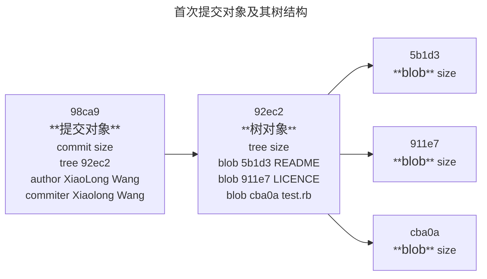

做些修改后再提交，那么这次产生的提交对象会包含一个指向上次提交对象（父对象）的指针。<br>

Git 的分支，实质上仅仅是指向提交对象的可变指针。Git 的默认分支名字是`main`。但`main`分支并不是一个特殊的分支。它和其他的分支并没有区别。之所以几乎每一个仓库都有`main`分支，是因为`git init`命令默认创建了它，并且大多数人懒得去改动它。

在多次提交操作之后，其实已经有一个指向最后那个提交对象的`main`分支。`main`分支会在每次提交时自动向前移动。

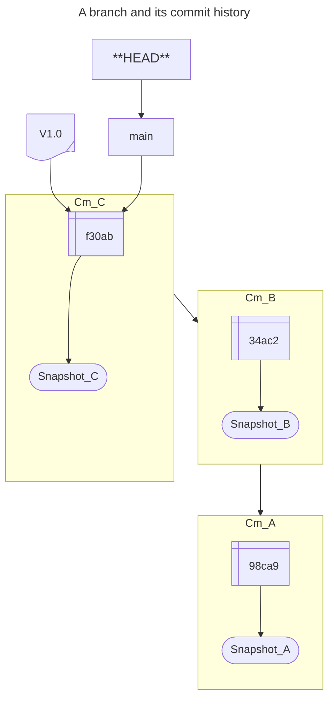

### 3.1.1  创建一个新分支

**`git branch <branchname>`**命令用于创建一个新的分支。该命令的实质是创建一个可以移动的新的指针。

比如，创建一个名为`testing`的分支，可以使用以下命令：

```shell
$ git branch testing
```

这会在当前所在的提交对象上创建一个指针。

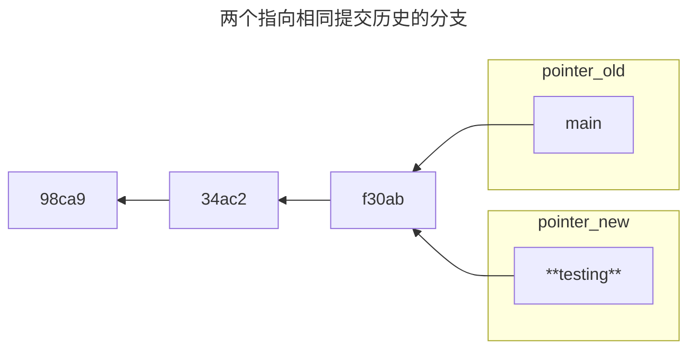

`git branch`命令仅仅**创建**了一个新分支，并不会自动切换到新分支中去。

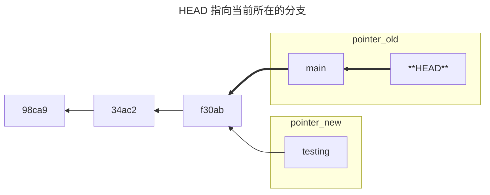

Git又是人生之道当前在哪一个分支上呢？<br>很简单，Git 有一个名为`HEAD`的指针。这个指针指向当前所在的本地分支（可以将`HEAD`想象成当前分支的别名）。

在上面的例子中，你仍然在`main`分支上。

**`git log <--oneline> --decorate`**命令查看各个分支当前所指的对象。其中主要是**`--decorate`**选项提供了这一功能。

正如所见，当前`main`和`testing`分支均指向校验和以`f30ab`开头的提交对象。<br>其中`HEAD`指向`mian`。

### 3.1.2  切换到一个分支

**`git checkout`**命令可以切换到一个已存在的分支。也就是指针`HEAD`指向了另一个已存在的分支。这时，被指向的分支的“别名”被称为`HEAD`。

例如，将当前分支`main`切换到已存在的分支`testing`，也就是将指针`HEAD`从分支`main`指向分支`testing`<br>（这时，分支`testing`的“别名”为`HEAD`）。

下图即显示了`git checkout testing`命令的执行结果：<br>

执行命令`git log --oneline --decorate`，可以看到`HEAD`指针已指向了`testing`分支。见下图：<br>
如下图所示：<br>

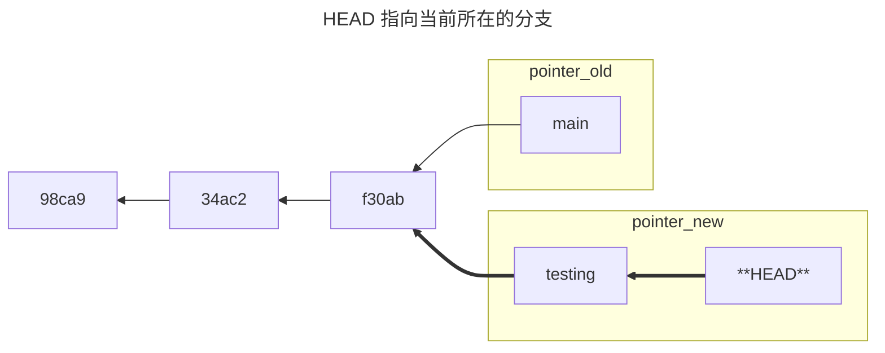

那么，这样的实现方式会给我们带来什么好处呢？现在不妨提交一次，以对文本文件`editor_sapmle.txt`进行修改，并在`testing`分支上进行提交为例。执行以下命令：

```shell
$ git vim editor_sample.txt # 打开文本编辑器 vim 对文件 editor_sample.txt 进行修改保存
$ git add editor_sample.txt # 对文本文件editor_sample.txt进行暂存
$ git commit -m 'new branch:testing commit' #对文件 editor_sample.txt 的修改进行提交
```

执行完毕，显示如下：<br>

用图示表示执行情况的图表如下：

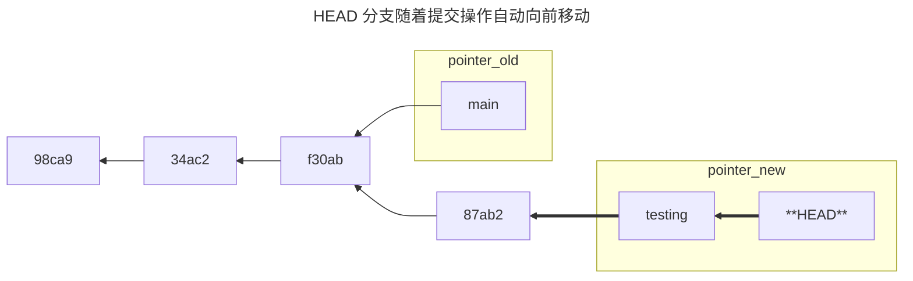

如图所示，`testing`分支向前移动了，但是`main`分支却没有移动，它仍然指向运行`git checkout`时说指的对象。

现在切换会`main`分支做一观察，执行以下命令：

```shell
$ git checkout main
```

执行上述命令，显示如下：<br>

用图示表示执行情况的图表如下：

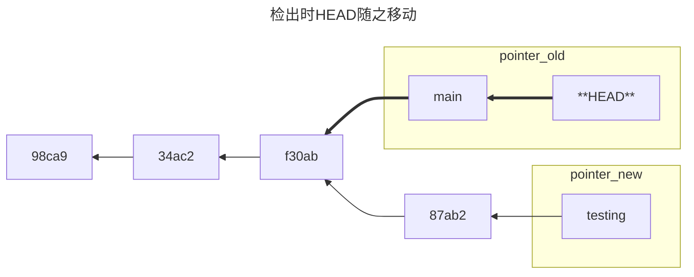

这条命令做了两件事：

1. 使**HEAD**指针指回到`main`分支；
2. 将工作目录恢复成`main`分支所指向的快照内容。<br>也就是说，现在做修改的话，项目始于一个较旧的版本。

本质上来讲，忽略`testing`分支所做的修改，以便于向里一个方向进行开发。

以对文本文件`editor_sapmle.txt`进行修改，并在`testing`分支上进行提交为例。执行以下命令：

```shell
$ git vim editor_sample.txt # 打开文本编辑器 vim 对文件 editor_sample.txt 进行修改保存
$ git add editor_sample.txt # 对文本文件editor_sample.txt进行暂存
$ git commit -m 'main branch commit' #对文件 editor_sample.txt 的修改进行提交
```

用图示表示执行情况的图表如下：

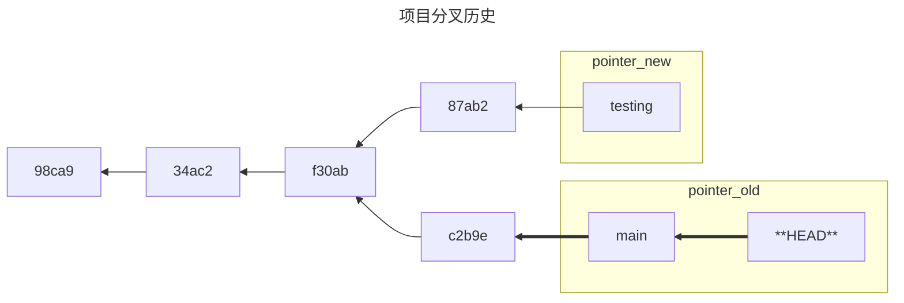

可以使用命令`git log`命令查看历史分叉。执行`git log --oneline --decorate --graph --all`，会输出提交历史、各个分支的指向以及项目分支的分叉情况。

执行上述命令，显示如下情况：<br>

由于 Git 的分支实质上仅是包含所指对象校验和（长度为 40 的 SHA-1 值字符串）的文件，所以它的创建和销毁都异常高效。 创建一个新分支就相当于往一个文件中写入 41 个字节（40 个字符和 1 个换行符）。

要**创建一个新分支**并且同时**切换到新分支**可以高效地一步完成。即执行以下命令：

**`git checkout -b <newbranchname>`**可以在创建新分支的同时切换到该分支当中去。

## 3.2  新建分支与合并分支的基本使用

让我们用在实际工作中可能会用到的工作流程来演示一个简单地创建分支以及合并分支的实例。我们将遵循以下步骤：

1. 在网站上开展一些工作。

2. 为实现某个新用户的需求，在网站上创建一个分支。

3. 在新建的分支上开展工作。<br>就在此时，我们接到了一个电话说，网站遇到了严重问题需要立即修复。我们将立即开展一下的工作：

4. 转换到你的线上分支（production branch）。

   > production branch，是一个在版本控制系统中用于存放生产环境代码的分支。通常开发团队会在本地创建这个分支，用于开发和测试代码，确保一切正常后再将其合并到主分支（“master” 或 ”main“）。

5. 为解决严重问题新建一个分支（即 hotfix branch），并在该分支上修复故障并测试。

6. 测试完成后，将 hotfix branch 合并到线上分支（production branch）并推送。

7. 转换到最初的新用户需求中去，继续工作……

整个工作流程中，该网站涉及到四个分支：

* master 分支，即网站的主分支。
* 为解决网站新用户问题而建立的新分支。
* production branch，即线上分支，网站开发团队在本地建立的用于开发和测试代码。
* Hotfix branch：为解决网站严重问题修复网站而建立的分支。

我们整个的工作流程如下：

1. 网站基础性工作；
2. 解决网站新用户问题的工作。
3. 解决网站突发问题的工作。

### 3.2.1 新建分支的基本操作

首先，假定我们已经在这个网站上开展一些工作，并且在网站主分支（master branch）上已经完成了一些提交。

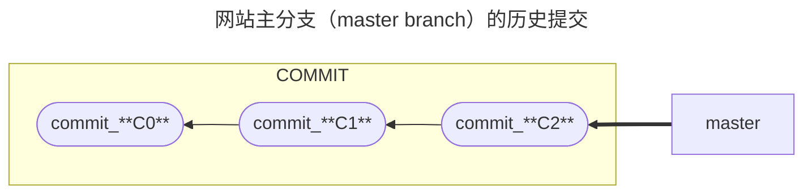

我们开始解决网站新客户提出的问题，该问题在公司“问题跟踪系统”（issue-tracking syestem）中编号为：#53。我们可以这个问题称为“iss3”。

使用带有参数`-b`的`git checkout`命令，新建一个分支并切换到该分支上：

```shell
$ git checkout -b iss53 # 新建分支名为“iss53”
```

这条命令等价于以下两条命令的组合：

```shell
$ git branch iss53 # 新建名为“iss53”的分支
$ git checkout iss53 # 从“master”分支切换到“iss53”分支
```

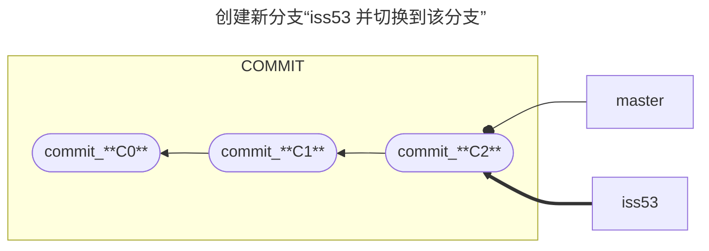

我们继续在iss53问题上工作，并完成了一些提交。在这个过程中`iss53`分支在不断地向前推移。如下图所示：

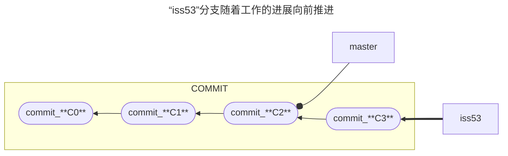

此时，我们接到了网站遇到了严重问题需要立即修复的电话通知。在 Git 中，我们仅需要切换会`master branch`即可开展网站严重问题的修复工作。但是，在切换分支前请务必做到：<br>**工作目录和暂存区中所有的修改已经提交完毕**，分支处在一个“**干净**”的状态下。否则，会因为有未提交的修改（changes）会与切换分支相冲突。

现在，假定我们做出的所有修改（changes）已经提交完毕。可以使用命令`git checkout master`切换到`master branch`中。我们可以专心解决网站遇到的严重问题。<br>**请牢记**：<big>*当切换分支的时候，Git 会重置工作目录，使工作目录和该分支最后一次提交完全一样*。</big>

接下来，我们要对严重问题进行修复。第一步是创建一个名为“热修复补丁程序”的分支（hotfix branch），并切换到该`hotfix branch`上开展相关工作。

我们使用命令`git checkout -b hotfix`即可完成。如下图所示：

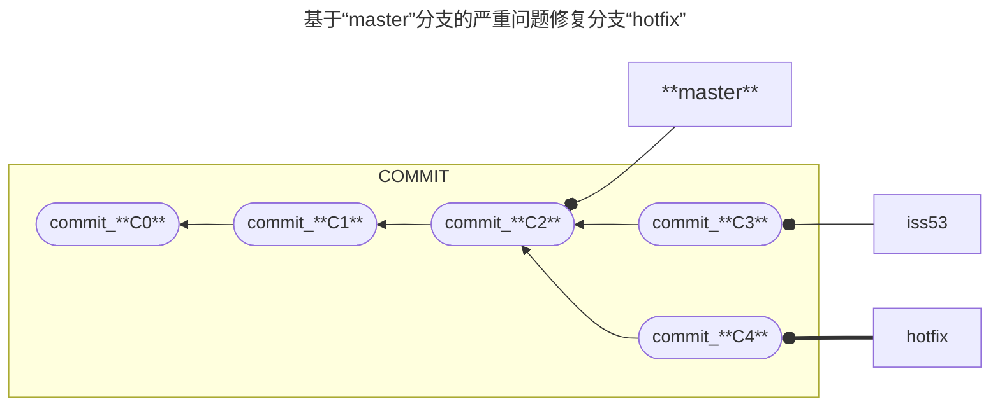

我们可以对热修复补丁程序（hotfix）做测试，确保它能够修复严重问题。然后，将热修复补丁程序分支（hotfix branch）合并到`master branch`并部署到线上（production）。我们可以使用以下命令来完成该项工作：

```shell
$ git checkout master # 切换到“master”分支
$ git merge hotfix # 将“hotfix”分支与“master”分支合并
```

如下图所示：<br>

在上图中，我们注意到“快进（Fast-forward”）这个词。由于我们想要合并到分支`hotfix`说指向的`C4`提交（commit）是所在的`C2`提交（commit）的直接后继，因此 Git 会直接将指针向前移动（指针`master`向前移到`C4`提交）。<br>换句话说（To phrase that another way），当你试图合并两个分支时，如果顺着一个分支走下去能够到达另一个分支，那么 Git 在合并两者的时候，只会简单地将指针向前推进（指针右移），因为这种情况下的合并操作没有需要解决的分歧——这就叫做“**快进（fast-forward）**”。

现在，最新的修改已经在 `master`分支所指向的提交快照中，我们可以着手发布该修复了。如下图所示：

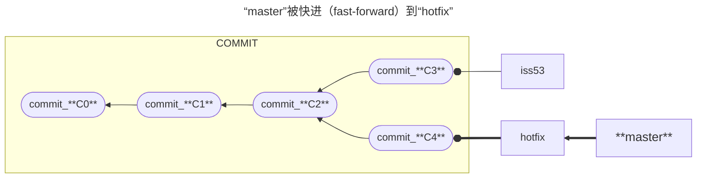

截至目前，严重问题已经修复完毕。我们要继续进行“iss53”问题的解决工作了。在开展此项工作前，我们应该先删除`hotfix`分支，因为我们再无需使用该分支了。可以使用带`-d`选项的`git branch`命令来删除`hotfix`分支。命令如下：

```shell
$ git branch -d hotfix
```

接下来，我们可以切换到“半成品（work-in-progress）分支”，即`iss53 branch`来解决“iss53”问题。使用`git checkout`命令即可搞定。

```shell
$ git checkout iss53
```

以上“两步”的工作，如下图所示：

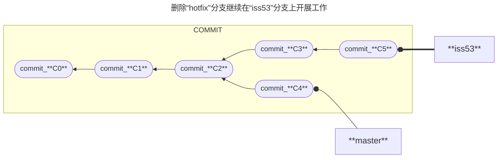

我们在`hotfix`分支上所做的工作并没有包含到`iss53`分之中。如果你需要拉取在`hotfix`分支上所做的修改，可以使用`git merge master`命令将 `master`分支合并入`iss53`分支。或者可以等到`iss53`完成气使命后，再将其合并回`master`分支。

### 3.2.2  分支合并到基本操作

假定我们已经解决了新客户在网站上的"iss53"问题，并打算将该项工作合并入`master`分支。为此，我们要将`iss53 branch`合并到`master branch`中。我们只需要检出到`master brach`，然后执行`git merge`命令即可完成。如下图所示：<br>

这和我们之前合并 `hotfix`分支的时候有所不同。在当前情况下，我们的开发历史从一个更早的地方开始分叉开来（diverged）。因为，`master`分支所在提交并不是`iss53`分支所在提交的直接祖先（direct ancestor），Git 必须做一些额外的工作。出现这种情况的时候，Git 会使用两个分支的末端所指的快照（`C4`和`C5`）以及两个分支的共同祖先（`C2`），做一个简单的三方（three-way）合并。具体入下图：

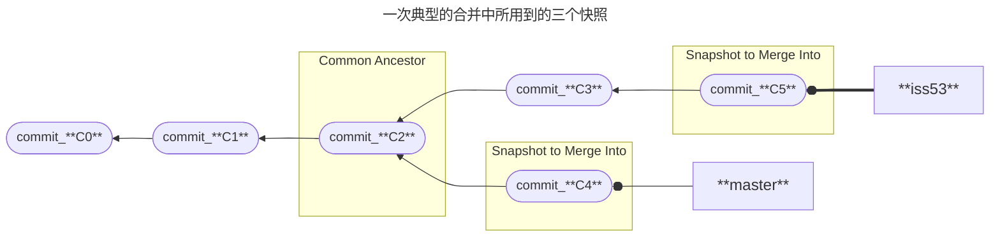

和之前将分支指针向前推进所不同的是，Git 将此次三方合并到结果做了一个新的快照并且自动创建一个新的提交指向它。这个被称作一次合并提交，它的特别之处在与它有不止一个父提交。入下图所示：

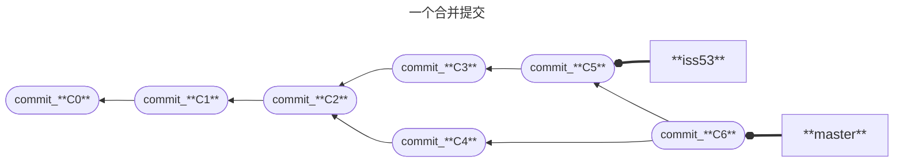

我们已经完成了合并，不再需要`iss53`分支了，也可以在任务追踪系统（issue-tracking-system）中关闭此项任务，并删除这个分支。执行以下命令：

```shell
$ git branch -d iss53
```

命令执行完毕后，如下图所示：

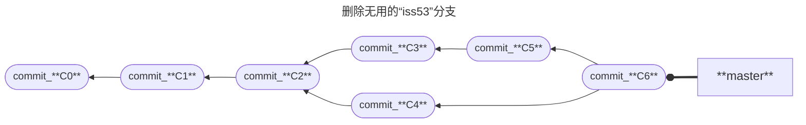

### 3.2.3  遇到分支合并冲突的基本操作

如果我们在不同的分支中，对同一个文件的同一个部分进行了不同的修改，Git 就无法彻底地合并它们。

假设`iss53`分支的修改和`hotfix`分支的修改都涉及到了同一文件的相同部分，且修改并不相同，在两个分支合并时就会产生合并冲突。如下图所示：<br>

此时，Git 虽然执行了`git merge`命令，但没有自动地创建一个新的合并提交。Git会暂停提交操作，直到我们解决了该冲突。

我们可以执行`git status`来查看那些因为包含合并冲突而处于未合并（unmerged）状态的文件。如下图所示：

任何因包含合并冲突而有待解决的文件，都会以**未合并状态（Unmerged）**标识出来。Git 会在有冲突的文件中加入**标准的冲突解决标记（standard conflict-resolution markers）**。我们可以打开这些包含冲突的文件，然后手动解决冲突。这些包含冲突的文件区段，类似于下图所示：<br>

这表示`HEAD`所指示的版本（也就是`master`分支所在的位置，因为在运行`git merge`命令时已经检出到了这个分支）在这个区段的上半部分（`=======`的上半部分），而`iss53`分支所指示的版本在`=======`的下半部分。为了解决冲突，我们必须选择使用由`======`分割的两部分中的一个，或者我们也可以自行合并这些内容。

例如，我们可以把这段内容换成下面的样子来解决冲突：


上述冲突解决方案仅保留了其中一个分支的修改，并且`<<<<<<<`，`=======`，和`>>>>>>>`这些行被完全删除了。

在解决了所有文件里的冲突之后，对每个文件使用`git add`命令来将其标记为冲突已解决。一旦暂存这些原本有冲突的文件，Git 就会将它们标记为冲突已解决。

**`git mergetool`**命令用来启动一个人合适的可视化合并工具，并带领我们一步一步解决冲突。

## 3.3  分支管理

**`git branc`**命令用于显示当前所有分支的一个列表。

执行`git branch`命令，显示如下：<br>

注意：在上图中，`main`分支前的`*`字符：它代表现在检出到那个分支（也就是 HEAD 指针所指向的分支）。这意味着，如果此时提交（commit），`main`分支将会随着新的工作向前移动。

**`git branch -v`**命令用于查看每一个分支的最后一次提交。<br>执行`git branch -v`命令，显示如下：<br>

`git branch`命令的两个参数选项：**`--merged`**和**`--no-merged`**用于过滤当前分子列表中**已经合并（`--merged`）**或**尚未合并（`--no-merged`）**到当前分支的分支。

* 执行命令**`git branch --merged`**，查看已经合并到当前分支的分支。如下图所示：<br>

* 执行命令**`git branch --no-merged`**，查看 所有包含未合并工作的分支。执行情况如下图所示：<br>

`git branch`的另外两个参数选项**`-d`**或者**`-D`**都是用来删除不需要继续使用的分支。不同的是：

* **`git branch -d <branchname>`**命令用于删除已经真和到另一个分支的分支。<br>比如：`testing`分支已经合并到`main`分支。
* **`git branch -D <branchname>`**命令，在想要删除的分支中还有尚未合并的工作，此时删除会丢失该工作内容的情况下，强制删除该分支。

## 3.4  分支开发工作流

现在，我们已经掌握了建立分支和合并分支的基础知识。我们可以将这些知识，应用到实际的工作当中去。

### 3.4.1  长期分支

许多使用 Git 的开发者都乐于使用这样的方式来工作：

* 他们只在`master`分支上保留完全稳定的代码——即已经发布或即将发布的代码。
  * 他们还有一些名为`develop`或者`next`的平行分支——被用来做后续开发或者测试稳定性。
    * 等到这些分支中的内容达到了稳定状态，会被合并入`master`分支。

事实上，我们刚才讨论的是随着不断地提交，指针在不断地右移的情况。也就是是说：

* “稳定分支”（例如 `master`分支）的指针总是落后于最新的提交一大截。
* “前沿分支”（例如`develop`或`next`分支）的指针总是指向最新的提交。

如下图所示：

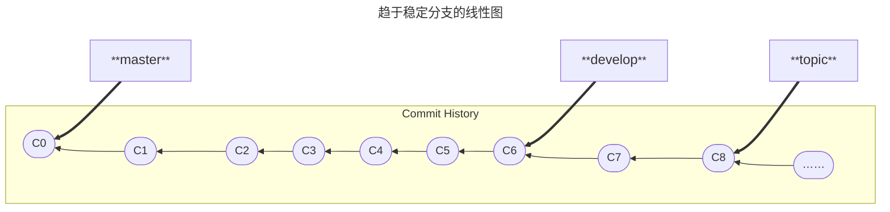

通常，把它们想象成流水线（work silos）可能更好理解一些，那些完成测试的提交会被遴选到更加稳定的流水线上去。


我们可以用这种方法来维护不同层次的稳定性。一些大型的项目还有一个`proposed`（建议）分支或`pu: proposed updates`（建议更新）分支，这个分支包含一些不够成熟的内容，因而不能进入`next`或者`master`分支。<br>这么做，可以使分支间具有不同级别的稳定性；当分支中的内容具有一定程度的稳定性之后，再把它们合并入具有更高级别稳定性的分支中。<br>应当强调的是，使用多个长期分支的方法并非必要，但是这么做通常会很有帮助，尤其是在一个非常庞大或者复杂的项目中。

### 3.4.2  主题分支

主题分支对任何规模的项目都适用。主题分支是一种短期分支，它被用来实现单一特性或其相关工作。

考虑这样一个例子：我们在`master`分支上工作到`C1`，这时为了解决一个问题而新建`iss91`分支，在`iss91`分支上工作到`C4`，然后对`iss91`分支上要解决的问题又有了新的解决方案，于是我们新建了一个`iss91v2`分支试图用该新方案来解决问题。接着我们又回到了`master`分支工作了一会，我们又冒出了一个不太确定的想法，便在`C10`的时候新建一个`dumbidea`分支，并在上面做了些实验。

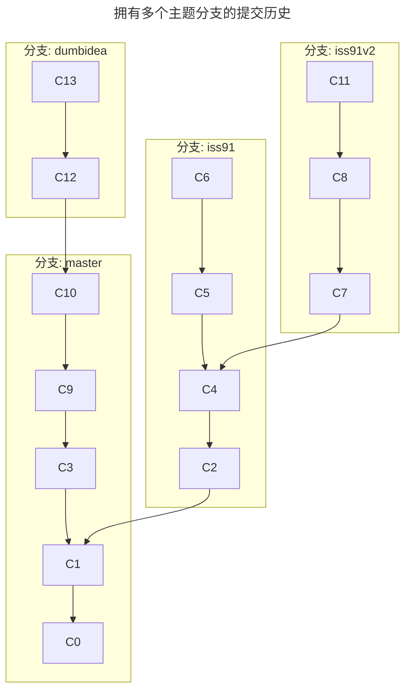

现在，我们假设两件事情：

1. 我们决定使用在`iss91v2`分支中的方案解决那个问题；
2. 我们将`dumbidea`分支拿给同事看过后，被认为是惊人之举。

这时，我们可以抛弃`iss91`分支，然后把另外两个分支合并入`master`分支。最终，我们的提交历史看起来像下面这个样子：

```mermaid
---
title: 合并了‘dumbidea’和‘iss91v2’分支之后的提交历史
---
flowchart TB
	subgraph 分支: dumbidea
		direction TB	
	end
C14-->C11
subgraph 分支: iss91v2
		direction TB
	end
C2-->C1
	subgraph 分支: master
		direction TB
		C14-->C13-->C12-->C10-->C9-->C3-->C1-->C0
	end
	subgraph   
		direction TB
		C11-->C8-->C7-->C4-->C2
	end
	
	
```

更多关于分支工作流的细节将在《分布式 Git》中进行介绍。

请牢记，当我们在做这些操作的时候，这些分支全部都存在于本地。也就是说，在我们新建和合并分支的时候，所有这一切都只发生在本地的 Git 版本库中——没有与服务器发生交互。

## 3.5  远程分支

**远程引用**（remote reference）是指对远程仓库的引用（指针），该引用包括分支、标签等。

* 使用命令`git remote ls-remote <remote>`来获得远程引用的完整列表。
  * 例如执行命令`git remote ls-remote <GPNs>`，显示如下：
* 使用命令`git show remote <remote>获得远程分支的更多信息。
  * 例如执行命令`git show remote GPNs`，显示如下：

**远程跟踪分支**是远程分支状态的引用。远程分支是本地分支在远程仓库中的反映。<br>每当与本地仓库与远程仓库进行通信时，Git 都会将本地仓库的情况准确地移动到远程仓库中。

远程仓库分支采用`<remote>/<branch>`的形式命名。

* 如果想查看最后一次与远程仓库`origin`通信时`master`分支的状态，可以查看`origin/master`分支。
* 如果与同事合作解决一个问题，在本地仓库中建立了`iss53`分支，并且他们在远程仓库`origin` 中推送了一个`iss53`分支，然而在服务器上的分支会以`origin/iss53`来表示。

举例说明。假设网络里有一个在`git.ourcompany.com`的 Git 服务器。如果从这里克隆，Git 的`clone`命令将自动把Git 服务器上的远程仓库命名为`origin`，拉取（pull down）所有的数据创建一个指向远程仓库（`origin`）`master`分支的指针，并且将该指针命名为`origin/master`。Git 也会给一个与`origin`的`master`分支在指向同一个地方的本地`master`分支。图示如下：

```mermaid
---
title: 克隆之后的服务器与本地仓库
---
flowchart TB
	subgraph git.ourcompany.com
		direction RL
		Git[master]-.-oC1
		C1([f4265])-->C2([a6b4c])-->C3([0b743])
	end
	subgraph My_Computer
		direction RL
		C1_1([f4265])-->C2_2([a6b4c])-->C3_3([0b743])
		origin/master-.-oC1_1
		local-.-oC1_1
		subgraph Remote Branch
			direction TB
			origin/master
		end
		subgraph Local branch
			direction BT
			local[master]
		end
	end
git.ourcompany.com == git clone janedoe @git.ourcompany.com:project.git ==> My_Computer	
```

我们在本地`master`分支上开展工作；与此同时，其他人将工作推送（push）提交到了`git.ourcompany.com`并且更新了它的`master`分支，这就是说彼此之间的提交历史走向了不同的方向。即便如此，只要我们不与`origin`服务器通信并不拉取（pull）数据，本地的`orgin/master`指针就不会移动。

如下图所示：

```mermaid
---
title: git.ourcompany.com的工作状况
---
graph RL
master==oC1_2
C1_2([190a3])-->C1_1([31b8e])-->C1([f4265])-->C2([a6b4c])-->C3([0b743])
A@{ shape: bow-rect, label: "someone else pushes" }-.->C1_2
A@{ shape: bow-rect, label: "someone else pushes" }-.->C1_1
```

```mermaid
---
title: My-Computer的工作状况
---
flowchart RL
C5([893cf])-->C4([a38de])-->C3([f4265])-->C2([a6b4c])-->c1([0b743])
orgin/master==oC3
master==oC5
```

**`git fetch <remote>`**命令用于与给定的远程仓库同步数据。<br>该命令用于查找`<remote>`是哪一个服务器，从中抓取（fetch）本地没有的数据并更新（update）本地数据库，移动本地`origin/master`指针到更新之后的位置。

如下图所示：

```mermaid
---
title: git fetch:更新本地的远程跟踪分支
---
flowchart TB
git.ourcompany.com== git fetch origin==>My_Computer
	subgraph git.ourcompany.com
		direction RL
		master==oC1_2
		C1_2([190a3])-->C1_1([31b8e])-->C1([f4265])-->C2_1([a6b4c])-->C3_1([0b743])
	end
	subgraph My_Computer
		direction RL
		C5([893cf])-->C4([a38de])-->C3([f4265])-->C2([a6b4c])-->c1([0b743])
		C7([190a3])-->C6([31b8e])-->C3
		MyComputer[master]==oC5
		origin/master==oC7
    end

```

为了演示多个远程仓库与远程分支的情况，假定我们有另一个内部 Git 服务器，仅服务于自己的开发团队。这个服务器位于`git.team1.ourcompany.com`。<br>我们可以运行`git remote add`命令添加一个新的远程仓库引用到当前的项目，我们将这个远程仓库命名为`teamone`，将作为其完整 URL 的缩写。关于`git remote add`命令会在《Git 基础》中详细说明。

如图所示：

现在，可以运行`git fetch teamone`来抓取（fetch）远程仓库`teamone`有（的数据），而本地没有的数据。因为那台服务器上现有的数据是`origin`服务器的一个子集（subset），所以 Git 并不会抓取数据而是会设置远程跟踪分支`teamone/master`指向`teamone`的`master`分支。

```mermaid
---
title: 远程跟踪分支teamone/master
---
graph TB
git.team1.ourcompany.com==git fetch teamone==>MyCompany
	subgraph git.ourcompany.com
		direction RL
		C1o([190a3])-->C2o([31b8e])-->C3o([f4265])-.->C4o([………])
		ourcompany[master]-.-oC1o
		end
	subgraph git.team1.ourcompany.com
		direction RL
		C1t([31b8e])-->C2t([f4265])-.->C3t([………])
		team1[master]-.-oC1t
	end
	subgraph MyCompany
		direction RL
		C5([893cf])-->C4([a38de])-->C3([f4265])-->C2([a6b4c])-->c1([0b743])
		C7([190a3])-->C6([31b8e])-->C3
		teamone/master-.-oC6
		origin/master-.-oC7
		my[master]-.-oC5
	end
	
```

### 3.5.1  推送

当我们想要公开分享一个分支时，需要将其推送（push）到有写入权限的远程仓库上。本地分支并不会自动与远程仓库同步——必须显式地（explicitly）推送想要分享的分支。<br>这样，我们可以把不愿意分享的内容放到私人分支上，而将需要和他人协作的内容推送到公开分支上。

如果我们希望和别人一起在名为`serverfix`的分支上工作，你可以像推送第一个分支那样推送它。执行命令`git push <remote> <branch>`。

以将`serverfix`分支推送到远程仓库`GPNs`为例，执行以下命令：

```shell
$ git push <GPNs> <serverfix>
```

如图所示：

在执行`git push <remote> <branch>`的过程中，很多工作被 Git 简化了。Git 自动将`serverfix`分支名展开为`refs/heads/serverfix: refs/heads/severfix`，这个扩展的含义是：“推送本地的`serverfix`分支来更新远程仓库上的`serverfix`分支”。

`git push <remote> <branch>`有一个具有相同功能的命令——`git push <remote> <branch>: <branch>`，这条命令的含义是“推送本地的`”分支名“`分支，将其作为远程仓库的`”分支名“`分支”。要推送到远程仓库的分支的名字还可以与本地的分支名不同，可以通过执行本命令实现。

例如：我们要将本地的`serverfix`分支推送到名为`GPNs`的远程仓库，并给新建的远程仓库分支起名为`awesomebranch`，可以执行以下命令：

```shell
$ git push GPNs serverfix: awesomebranch
# serverfix为本地分支名；awesomebranch为在远程仓库中新建的分支名；serverfix分支和 awesomebranch 是一样的，只是名字不同而已
```

下一次其他协作者从服务器上抓取（fetch）数据时，会在本地生成一个远程分支`origin/serverfix`，指向服务器的`serverfix`分支的引用。<br>要特别注意的是：当抓取新的远程跟踪分支时，本地不会自动生成一份可编辑的副本（copy）。在这种情况下，不会有一个新的`serverfix`分支——只有一个不可修改的`origin/serverfix`指针。<br>可以执行`git merge origin/serverfix`将这些工作合并到当前所在的分支。如果想要在自己的`serverfix`分支上工作，可以将其建立在远程跟踪分支上：`git checkout -b serverfix origin/serverfix`，这会建立一个名为`serverfix` 的本地分支，并且起点位于`origin/serverfix`。

### 3.5.2  跟踪分支

从一个远程跟踪分支检出（check out）会自动创建所谓的“跟踪分支”（该”跟踪分支“跟踪的分支叫做”上游分支“）。跟踪分支位于本地，与上游分支（远程分支）有直接关系。如果在一个跟踪分支上输入`git pull`，Git 能自动识别去某个服务器上抓取、合并到那个分支。

当克隆一个仓库时，通常会自动创建一个跟踪`origin/master`分支的`master`分支。但是，还可以自由做出以下选择：

* 设置其他的跟踪分支；
* 设置在其它远程仓库上的跟踪分支；
* 不跟踪`master`分支。

实现以上功能可以执行命令`git checkout -b <branch> <remote>/<branch>`。这是一个十分常见的操作，所以 Git提供了`--track`的快捷方式，完整的命令为`git checkout --track <remote>/<branch>`。

在`--track`的快捷方式的基础上，还有一个捷径。如果尝试检出的分支同时符合下列条件：

1. 不存在（即以往的分支中没有该分支）。
2. 只有一个名字与之匹配的远程分支。

那么，Git 就会自动创建一个跟踪分支。执行命令`git checkout <branchname>`<br>如果要将本地分支与远程分支设置为不同的名字，可以使用`-b`选项来设置不同的分支名：`git checkout -b <new_branchname> <remote>/<branchname>`。

修改本地分支正在跟踪的上游分支，可以使用选项`-u`或`--set-upstream-to`选项，在命令`git branch`来显式地设置。完整的命令如下：

```shell
$ git -u <remote>/<branchname>
# 或
¥ git --set-upstream-to <remote>/<branchname>
```

例如，我们想将本地分支`main_one`从跟踪上游远程分支`GPNs/main`切换到跟踪远程分支`GPNs/serverfix`可以执行以下命令实现：

```shell
$ git checkout main_one # 检出到分支`main_one`
$ git branch -u GPNs/serverfix # 跟踪远程分支`serverfix`
```

执行上述命令的情况如下图：

再举一例，将本地分支`serverfix`从跟踪的上游远程分支`GPNs/main_one`，切换到远程分支`GPNs/serverfix`，可以执行以下命令实现：

```shell
$ git checkout serverfix # 检出到分支`serverfix`
$ git branch --set-upstream-to GPNs/serverfix # 跟踪远程分支`serverfix`
```

执行上述命令的情况如下图：

命令**`git branch -vv`**用于查看设置的所有跟踪分支，所有的本地分支和详细信息都将陈列出来。如下图所示：

### 3.5.3  拉取（pulling）

命令`git fetch`用于从服务器上抓取（fetch）本地没有的数据，但不会修改工作目录中的内容。

**`git pull`**命令用于从服务器上抓取本地没有的数据，并且将数据合并入分支。也就是说，<br>**`git pull` = `git fetch` + `git merge`**。由于`git pull`命令是两个命令的组合，因此它的使用起来总是令人迷惑，所以单独显式地使用`git fetch`和`git merge`命令会更好一些。

### 3.5.4  删除远程分支

**`git push <remote> --delete <branchname>`**用于删除远程分支。<br>`git branch -d <branchname>`用于删除本地分支。

例如，我们要删除远程分支和本地分支`serverfix`，分别执行以下命令：

```shell
$ git push GPNs --delete serverfix # 删除远程分支`serverfix`
```

如下图所示：

```shell
$ git branch -d serverfix # 删除本地分支`serverfix`
```

## 3.6  变基

在 Git 中，有两种主要的方法将更改（changes）从一个分支整合到另一个分支中去：

* 合并（merge）
* 变基（rebase）

这一节的主要内容是学习什么是变基、如何使用变基，为什么变基是一个高效的工具以及在什么情况下，它是无法适用的。

### 3.6.1  变基的基础知识

如果回顾《合并的基础知识》那一节，就会看到如何对工作在不同的分支上进行分叉（diverge）和提交（commit）。如下图所示：

```mermaid
---
title: 简明的分叉历史
---
graph RL
C3([C3])--> C2([C2])-->C1([C1])-->C0([C0])
C4-->C2
	subgraph experiment branch
		direction TB
		experiment--oC4([C4])
	end
	subgraph master branch
		direction BT
		master--oC3
	end
```
正如前面所提到的，最简单地整合分支的命令是`merge`。该命令在两个最新的分支快照（C3 和 C4）和它们最近的共同祖先分支（C2）进行了三方（three-way）合并，创造了一个新的快照（并提交）。如下图所示：
```mermaid
---
title: 通过合并来整合分叉的历史工作
---
graph RL
C5([C5])-->C3([C3])-->C2([C2])-->C1([C1])-->C0([C0])
C5-->C4-->C2
	subgraph experiment branch
		direction TB
		experiment--oC4([C4])
	end
	subgraph master branch
		direction BT
		master--oC5
	end
```
其实，还有一种方法：可以提取在`C4`中引入的补丁和修改（change），然后在`C3`的基础上再应用一次。在 Git 中，这种操作叫做**变基**（rebasing）。使用`rebase`命令，将提交到某一个分支上的所有修改全部移至另一个分支上，就好像“重放”（replay）一样。

在这个例子中，你可以检出`experiment`分支，然后将它变基到`master`分支上：

```shell
$ git checkout experiment
$ git rebase master
```

**变基的原理是**：

* 首先，找到这两个分支（即当前分支`experiment`、变基操作的目标基底分支`master`）；
* 然后，对比当前分支`experiment`相对于该祖先`master`的历次提交，提取相应的修改并存为临时文件；
* 其次，将当前分支`experiment`指向目标基底`C3`；
* 最后，将临时文件依序提交到基底`C3`的后面。

如下图所示：

```mermaid
---
title: 将`C4`中的修改变基到`C3`上
---
graph RL
C4'([**<big>C4'</big>**])-->C3([**<big>C3</big>**])-->C2([**<big>C2</big>**])-->C1([**<big>C1</big>**])-->C0([**<big>C0</big>**])
C4([<small>C4</small>])-.->C2
experiment--oC4'
master--oC3
```

此时，我们可以回到`master`分支，进行一次快进合并。

```shell
$ git checkout master
$ git merge experiment
```

如下图所示：

```mermaid
---
title: ‘master’分支的快进合并
---
graph RL
C4'([**<big>C4'</big>**])-->C3([**<big>C3</big>**])-->C2([**<big>C2</big>**])-->C1([**<big>C1</big>**])-->C0([**<big>C0</big>**])
experiment--oC4'
master--oC4'
```

此时，`C4'`指向的快照就和《the merge example》中`C5`指向的快照一模一样了。这两种整合方法的最终结果没有任何区别，但是变基（rebase）使得提交历史更加整洁。<br>我们在查看一个经过变基的分支的历史记录时会发现，尽管实际的开发工作是并行的，但它们它们看上去就和串行的是一样的，提交历史是一条直线没有分叉。

一般我们这样做的目的是为了确保在向远程分支推送时能保持提交历史的整洁——例如向他人维护的项目贡献代码时。我们首先在知己的分支里进行开发，当开发完成时需要先将你的代码变基到`origin/master`上，然后再向主项目提交修改。这样的话，该项目的维护者就不再需要进行整合工作，只需要快进合并便可。

请注意，**无论是通过变基，还是通过三方合并，整合的最终结果所指向的快照始终是一样的**，只不过提交历史不同罢了。

* 变基（rebase）是将一系列提交按照原有次序依次应用到另一分支上；

* 合并（merge）是把最终结果合在一起。


### 3.6.2  更加有趣的变基

在对两个分支进行变基时，所生成的“重放”（replay）并不一定要在目标分支上应用，我们也可以指定另外的一个分支进行应用。就像从一个主题分支中再分出一个主题分支的提交历史中的例子那样：<br>在分支`master`上创建了一个分支`server`，在此分支上添加了一些功能，并提交了`C3`和`C4`。然后在`C3`上创建了另一个主题分支`client`，添加了一些功能，提交了`C8`和`C9`。最后，我们回到了`server`分支，提交了`C10`。如下图所示：

```mermaid
---
title: 从一个主题分支再分出一个主题分支的提交历史
---
graph RL
C6([**<big>C6</big>**])-->C5([**<big>C5</big>**])-->C2([**<big>C2</big>**])-->C1([**<big>C1</big>**])
master-.-oC6
C10([**<big>C10</big>**])-->C4([**<big>C4</big>**])-->C3([**<big>C3</big>**])-->C2
server-.-oC10
C9([**<big>C9</big>**])-->C8([**<big>C8</big>**])-->C3([**<big>C3</big>**])
client-.-oC9
```
假设我们决定将`client`分支的修改（`C8`和 `C9`）合并到`master`分支上，但不添加`server`分支上的修改。要完成这项任务可以使用`git rebase`命令中的`--onto`选项。完整命令如下：
```shell
$ git rebase --onto master server client
```
以上命令的意思是：“取出`client`分支，找到它从`server`分支分叉之后的补丁，然后把这些补丁在`master`分支上重放（replay）一遍”。

```mermaid
---
title: 截取主题分支上的另一个主题分支，然后变基到其他分支
---
graph RL
C9'([**<big>C9'</big>**])-->C8'([**<big>C8'</big>**])-->C6([**<big>C6</big>**])-->C5([**<big>C5</big>**])-->C2([**<big>C2</big>**])-->C1([**<big>C1</big>**])
master-.-oC6
client-.-oC9'
C10([**<big>C10</big>**])-->C4([**<big>C4</big>**])-->C3([**<big>C3</big>**])-->C2
server-.-oC10
C9([<small>C9</small>])-.->C8([<small>C8</small>])-.->C3([**<big>C3</big>**])
```

现在可以快进（fast-forward）合并`master`分支了。可以使用命令`git checkout master`和`git merge client`，快进合并`master`分支，使之包含来自`client`分支的修改:

```shell
$ git checkout master
$ git merge client
```

如图下图所示：

```mermaid
---
title: 快进合并‘master’分支，使之包含来自‘client’分支的修改
---
graph RL
C9'([**<big>C9'</big>**])-->C8'([**<big>C8'</big>**])-->C6([**<big>C6</big>**])-->C5([**<big>C5</big>**])-->C2([**<big>C2</big>**])-->C1([**<big>C1</big>**])
master-.-oC9'
client-.-oC9'
C10([**<big>C10</big>**])-->C4([**<big>C4</big>**])-->C3([**<big>C3</big>**])-->C2
server-.-oC10
```


假设我们决定将`server`分支上的修改也整合进来。使用`git rebase <basebranch> <topicbranch>`命令可以直接将主题分支（即本例中的`server`）变基到目标分支（即`master`）上。这样做，省去了先切换到`server`分支，再对其执行变基命令的多个步骤。具体命令如下：

```shell
$ git rebase master server
```

如下图所示，将`server`分支中的修改变基到`master`分支上，也就是将`server`分支上的提交（commit）“续接”到了`master`分支的后面。

```mermaid
---
title: 将‘server’分支上的修改变基到‘master’分支上
---
graph RL
C10'([**<big>C10'</big>**])-->C4'([**<big>C4'</big>**])-->C3'([**<big>C3'</big>**])-->C9'([**<big>C9'</big>**])-->C8'([**<big>C8'</big>**])-->C6([**<big>C6</big>**])-->C5([**<big>C5</big>**])-->C2([**<big>C2</big>**])-->C1([**<big>C1</big>**])
master-.-oC9'
client-.-oC9'
C10([C10])-.->C4([C4])-.->C3([C3])-.->C2
server-.-oC10'
```

然后，我们可以快进（fast-forward）合并主分支（`master`），执行如下命令：

```shell
$ git checkout master
$ git merge server
```

至此，`client`和`server`分支中的修改都已经整合到了主分支（master）里。我们可以删除`server`、`client`两个分支。执行`git branch -d <branchname`命令如下：

```shell
$ git branch -d server
$ git branch -d client
```

最终，提交历史变成下图中的样子：

```mermaid
---
title: 最终的提交历史
---
graph RL
C10'([**<big>C10'</big>**])-->C4'([**<big>C4'</big>**])-->C3'([**<big>C3'</big>**])-->C9'([**<big>C9'</big>**])-->C8'([**<big>C8'</big>**])-->C6([**<big>C6</big>**])-->C5([**<big>C5</big>**])-->C2([**<big>C2</big>**])-->C1([**<big>C1</big>**])
master-.-oC10'


```

### 3.6.3  变基的风险

奇妙的变基并非完美无缺。使用变基（rebase）要遵循一条准则：

**如果提交存在于你的仓库之外，而他人可能基于这些提交进行开发，那么不要执行变基。**

变基操作的实质是丢弃一些现有的提交，然后相应地新建一些内容一样但实际上并不相同的提交。如果我们已经将提交推送到某个仓库，而其他人已经从该仓库拉取（pull）了提交并进行了后续工作。此时，如果我们用`git rebase`命令重新整理了提交并再次推送，那么他人因此将不得不将他们手头的工作与你的提交进行整合；如果接下来我们还要拉取并整合他们修改过的提交，事情就会变得一团糟。

让我们来看一个在公开仓库中执行变基操作所带来的问题。<br>假设我们从一个中央服务器克隆然后在它的基础上进行了一些开发。我们的提交如图所示：

```mermaid
---
title: clone 一个仓库，然后在它的基础上开展一些工作
---
graph TB
git.team1.ourcompany.com==clone==>My_Computer
	subgraph git.team1.ourcompany.com
		direction RL
		master-.-oC1([C1])
	end
	subgraph My_Computer
		direction RL
		C3([C3])-->C2([C2])-->C1'([C1])
		teamone/master-.-oC1'
		point[master]-.-oC3
	end
```

然后，某人又向中央服务器提交了一些修改，其中还包括一次合并。我们抓取了这些远程分支上的修改，并将其合并到你本地的开发分支，然后你的提交历史就会变成这样：

```mermaid
---
title: 抓取别人的提交，合并到自己的开发分支
---
graph TB
git.team1.ourcompany.com==Fetch and Clone==>My_Computer
	subgraph git.team1.ourcompany.com
		direction RL
		C6([C6])-->C4([C4])-->C1([C1])
		C6([C6])-->C5([C5])-->C1([C1])
		master-.-oC6([C6])
	end
	subgraph My_Computer
		direction RL
		C6'([C6])-->C4'([C4])-->C1'([C1])
		C6'([C6])-->C5'([C5])-->C1'([C1])
		C7([C7])-->C3([C3])-->C2([C2])-->C1'([C1])
		C7-->C6'
		teamone/master-.-oC6'
		point[master]-.-oC7
	end
```

接下来，这个人又决定把合并操作回滚，改用变基；继而又用`git push --force`命令覆盖了服务器上的提交历史。之后我们从服务器抓取更新，会发现多出来一些新的提交。

```mermaid
---
title: 有人推送了经过变基的提交，并丢弃了你的本地开发所基于的一些提交
---
graph TB
git.team1.ourcompany.com==Fetch and Bring down the new commits==>My_Computer
	subgraph git.team1.ourcompany.com
		direction RL
		C6([C6])-.->C4([C4])-.->C1([**<big>C1</big>**])
		C6([C6])-.->C5([**<big>C5</big>**])-->C1([**<big>C1</big>**])
		C4''([**<big>C4'</big>**])-->C5([**<big>C5</big>**])
		master-.-oC4''
	end
	subgraph My_Computer
		direction RL
		C6'([C6])-->C4'([C4])-->C1'([C1])
		C6'([C6])-->C5'([C5])-->C1'([C1])
		C7([C7])-->C3([C3])-->C2([C2])-->C1'([C1])
		C7-->C6'
		C4_2([C4'])-->C5'
		teamone/master-.-oC4_2
		point[master]-.-oC7
	end
```

现在，我们和他都陷入到了尴尬的境地。如果我们执行`git pull`命令，将会创造一个和并提交将来自两条提交历史的内容，合并在了一起。最终本地仓库将如图所示：

```mermaid
---
title: 我们将相同的内容又合并了一次，生成了一个新的提交
---
graph TB
git.team1.ourcompany.com==Git pull and Creat a merge commit==>My_Computer
	subgraph git.team1.ourcompany.com
		direction RL
		C6([C6])-.->C4([C4])-.->C1([**<big>C1</big>**])
		C6([C6])-.->C5([**<big>C5</big>**])-->C1([**<big>C1</big>**])
		C4''([**<big>C4'</big>**])-->C5([**<big>C5</big>**])
		master-.-oC4''
	end
	subgraph My_Computer
		direction RL
		C6'([C6])-->C4'([C4])-->C1'([C1])
		C6'([C6])-->C5'([C5])-->C1'([C1])
		C7([C7])-->C3([C3])-->C2([C2])-->C1'([C1])
		C8([C8])-->C7-->C6'
		C8-->C4_2([C4'])-->C5'
		teamone/master-.-oC4_2
		point[master]-.-oC8
	end
```
如果此时我们执行`git log`命令，将会看到两个提交的历史记录完全一样：一样作者、一样的日期以及一样的信息。这些都非常令人迷惑。<br>更进一步，如果我们将此推送到服务器上，就会把那些变基的提交再次引用，这会更加令人迷惑。很明显其他开发者并不想在提交历史中看到`C4`和`C6`，因为之前就是他把这两个提交（`C4`和`C6`）通过变基丢弃的。

### 3.6.4  用变基解决变基

如果你**确实（do）**遭遇了类似的处境，Git 还有一些高级的魔法可以帮到我们。如果团队中的某人强制推送并覆盖了一些你所基于的提交，你需要做的就是检查你做了哪些修改，以及他们覆盖了哪些修改。

实际上，Git 除了对整个提交计算 SHA-1 校验和之外，也对本次提交所引入的修改计算校验和——即“patch-id”。

如果你拉取被覆盖过的更新并将你手头的工作基于此进行变基的话，一般情况下 Git 都能成功分辨出哪些是你的修改，并把它们应用到新分支上。

举个例子，如果遇到前面提到的，有人推送了经过变基的提交，并丢弃了你的本地开发所基于的一些提交那种情况，如果我们不是执行合并，而是执行`git rebase teamone/master`，Git 将会：

* 检查哪些提交是我们的分支上独有的（C2、C3、C4、C6、C7）
* 检查其中哪些提交不是合并操作的结果（C2、C3、C4）
* 检查哪些提交在对方覆盖更新时并没有被纳入目标分支（只有 C2 和 C3，因为 C4 其实就是 C4'）
* 把查到的这些提交应用在`teamone/master`上面

从而我们将得到的是，将相同的内容又合并了一次，生成了一个新的提交中不同的结果。如图在一个被变基然后强制推送的分支上再次执行变基所示：

```mermaid
---
title: 在一个被变基然后强制推送的分支上再次执行变基
---
graph TB
git.team1.ourcompany.com==在一个被变基然后强制推送的分支上再次执行变基==>My_Computer
	subgraph git.team1.ourcompany.com
		direction RL
		C6([C6])-.->C4([C4])-.->C1([**<big>C1</big>**])
		C6([C6])-.->C5([**<big>C5</big>**])-->C1([**<big>C1</big>**])
		C4''([**<big>C4'</big>**])-->C5([**<big>C5</big>**])
		master-.-oC4''
	end
	subgraph My_Computer
		direction RL
		C3'([C3'])-->C2'([C2'])-->C4'([C4'])-->C5'([C5])-->C1'([C1])
		teamone/master-.-oC4'
		point[master]-.-oC3'
	end
```

要想上述方案有效，还需要对方在变基时确保`C4'`和`C4`是几乎一样的。否则变基操作将无法识别（tell），并新建一个类似`C4`的补丁（而这个补丁很可能无法整洁的整合入历史，因为补丁中的修改已经存在于某个地方了）。

在本例中，另一种简单的方法是使用`git pull --rebase`命令而不是直接`git pull`。又或者我们可以自己手动完成这个过程，先`git fetch`，再`git rebase teamone/master`。

如果我们习惯使用`git pull`，同时又希望默认使用选项`--rebase`，我们可以执行这条语句`git config --global pull.rebase true`来更改`pull rebase`的默认配置。

* 如果我们只对不会离开自己电脑的提交执行变基，那就不会有事。
* 如果我们对已经推送过的提交执行变基，但他人没有基于它的提交，那也不会有事。
* 如果我们对已经推送到共用仓库的提交上执行变基命令，并因此丢失了一些别人的开发所基于的提交，那我们就有大麻烦了。
* 如果我们或我们的同事（partner）在某些情形下决意要这么做，请一定要通知每个人执行`git pull --rebase`命令，这样尽管不能避免伤痛，但能有所缓解。

### 3.6.5  变基 VS. 合并

变基操作和合并操作究竟哪一个更好呢？在回答这个问提前，让我们退后一步，讨论一下提交历史（history）意味着什么。

* 有一种观点认为，**仓库的提交历史即是记录实际发生了什么**。提交历史是对历史的记录，本身就有价值，不能改动。
  * 从这个角度来看，改变提交历史，是**使用谎言掩盖实际发生的事情**。
  * 但，如果历史提交是一团糟怎么办？
    * 既然事实就是如此，那么就把这些原原本本地保留下来，让后人能够查阅。
* 另一种恰恰相反的观点认为，**提交历史只是项目过程中发生的事情，只有经过反复修订才能方便使用**。
  * 持有这一观点的人会使用`rebase`和`filter-branch`等工具来编写提交历史。
    * 怎么方便后来的读者就怎么写。

现在，回到之前的问题：到底变基操作和合并操作哪一个更好呢？显然这不是一个非黑即白、非好即坏的答案。<br>既然两个工具（`rebase` 和 `merge`）同时在手，我们应该根据实际情况做出明智的选择。**总的原则是：**

**1. 只对尚未推送或分享给他人的本地修改执行变基操作清理历史；**

**2. 绝不对已经推送到别处的提交执行变基操作。**

这样，我们才能享受到两种方式带来的便利。

## 3.7 总结

我们已经学习了 Git 分支与合并的基础知识：

* 创建并切换到新分支；
* 在不同的分支之间切换；
* 合并本地分支。
* 推送分支至共享服务以分享分支；
* 使用共享分支与他人协作；
* 在共享之前使用变基操作合并分支。

