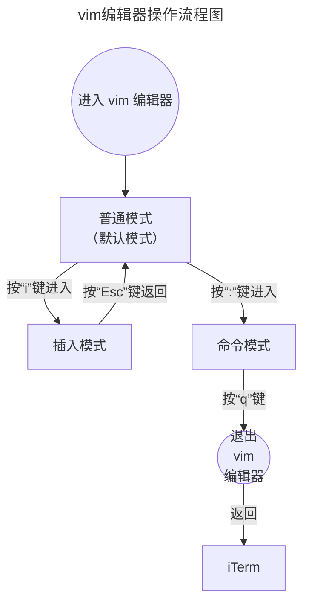

# 文本编辑器简明使用教程——以 vim 为例

在 Git 版本管理系统中，使用**vim**文本编辑器可以高效地进行文本编辑。但 vim 编辑器的操作不直观，因此需要对其基本的操作进行总结。

## Git中查询和设置默认的文本编辑器

可以使用相应的命令来查询和设置默认的文本编辑器。

### 查询Git默认的文本编辑器

要知道 Git中内置的默认文本编辑器，可以使用命令：

```shell
$ git config --get core.editor
```

在 iTerm 中执行该命令后显示如下：


该显示表明，Git 的默认文本编辑器为：vim。

### 更改Git默认的文本编辑器

如果希望更改 Git 默认的文本编辑器，可以使用以下命令来设置：

```shell
$ git config --global core.editor "vim" # vim为设置的默认文本编辑器名称
```

设置完毕后，可以使用`git config --get core.editor`命令查询默认的文本编辑器。

通过查询Git配置和环境变量，可以轻松地确认当前使用的编辑器，并根据需要进行更改以适应工作习惯。

## 文本编辑器的简单使用

设置好默认的文本编辑器后，接下来就是在需要的时候启动它，并使用它对文本进行编辑并保存。

### 启动Vim

#### 使用vim打开文件

要打开一个文件进行编辑，可以输入以下命令：

```shell
$ vim filename.txt # “filename”为文件名；".txt"为文件名后缀。
```

#### 直接启动vim

若不想打开文件，只需在终端中输入`vim`启动编辑器。命令如下：

```shell
$ vim
```

终端中显示如下界面，可以按照界面中的提示进行下一步操作：


### 基本操作模式

vim有多个操作模式，最常用的是**普通模式**、**插入模式**和**命令模式**。每个模式都有各自不同用途和功能，可以使用快捷方式进行切换。

1. **普通模式**是 vim 的**默认模式**，启动vim后通常就处于此模式。
   * 该模式用于导航和执行命令。**不能在该模式中进行文本的输入和编辑**。
2. **插入模式**在该模式下，**只能专门用于输入、修改文本**。即便是保存编辑的文档也不可以。
3. 命令模式**只能用于执行文件保存、退出等命令**。

三种模式从界面中可以通过左下角的标识进行分辨：

* 普通模式，左下角有文件名和相关内容数据。见下图：
* 插入模式，左下角有**`-- INSET --`**标识。见下图：
* 命令模式，左下角有**`:`**并有光标闪动。见下图：

三种模式作用不同、功能各异，因此在文本编辑过程中需要切换到不同的模式下完成相应的操作。具体操作如下：



vim 文本编辑器使用的关键是：**知道它的三个模式，并且能够在普通模式、插入模式和命令模式之间自如地切换**。这样，使用 vim 并不难。

我在刚开始使用 vim 的时候，一上来就按照过去使用 word 文档的方法一顿操作猛如虎，结果发现 vim 竟然“我自岿然不动”。于是，通过 ChatGPT 查询使用方法，又没有做到只字不差地阅读，还是按照想当然的方法操作 vim。

结果，**把自己扔进了烦躁——焦虑——放弃的“死循环”当中，这是学习新知识、习得新技能，导致半途而废的常见心理机制**。

我决定以写教程的方式，教会自己使用 vim 文本编辑器，这也算是意外的收获吧。

所有的学习都是“自学”。无论是跟着老师学、照着书本学，还是在实践中总结经验教训学，都必须是自己主动学，是自己把自己教会。还多时候，觉得某些知识、某项技能很难，自己根本学不会，其实是给自己缺乏学习的热情和主动性找借口。正如“你永远叫不醒一个装睡的人”……

在自己教会自己的过程中，经常会遇到要学习新知识、新技能，就必须掌握一些与学习目标知识、技能相关联的知识和技能。这些知识和技能，往往构成了完成目标知识技能学习的“拦路虎”，事实上增加了目标知识技能的学习难度和规模。所谓学无止境，不仅指学习目标知识技能本身，还有目标知识技能衍生出的关联知识技能。这是由知识的网状结构特征决定的。只要你开始学习，就只能学习更多；学习地更多，就有更多的知识，等着你去学习……

如果理解并学会了在三种模式之间转换，那么 vim 文本编辑器就等于掌握了。为了使教程更加完整，方便高效地使用 vim 文本编辑器。下面是关于一些基本的操作介绍：

1. 文本编辑：

   进行文本编辑前，务必进入到插入模式中。从普通模式转换到插入模式需要在普通模式下：

   * 按`i`键，在光标前插入文本。
   * 按`a`键，在光标后插入文本。
   * 按'o'键，在当前下方打开新行。

   如果觉得太复杂，就记住，在键盘输入英文的情况下，按'i'键。

2. 文件操作：

   要进行文件操作的前提是必须退出插入模式，进入到普通模式，然后切换成命令模式。操作流程如下：

   ```mermaid
   ---
   title: 插入模式到命令模式切换流程图
   ---
   graph LR
   B[插入模式] -->|按“Esc”键返回|A[普通模式<br>（默认模式）]
   A[普通模式] -->|按“:”键进入| C[命令模式] 
   ```

   在命令模式中，有常用的操作键总结如下：

   |     按键      | 作用                                      |
   | :-----------: | :---------------------------------------- |
   |     `:w`      | 保存文件。                                |
   | `:w filename` | 另存为指定文件。                          |
   |     `:q`      | 退出 vim 文本编辑器                       |
   |     `:q!`     | 强制退出 vim 文本编辑器，不保存文本更改。 |
   |  `:wq`或`zz`  | 保存文本文件并退出 vim文本编辑器。        |

这些都是文本编辑和文件操作的“**最少必要知识**”，了解了这些知识 vim 文本编辑器即可上手使用。

当然，要学习的知识还远不止这些，但对于工具使用者要做到的第一步是“会用”就行了。要做到精通，也无非去践行卖油翁说的那句平淡的话：

> 无他，但手熟尔。


